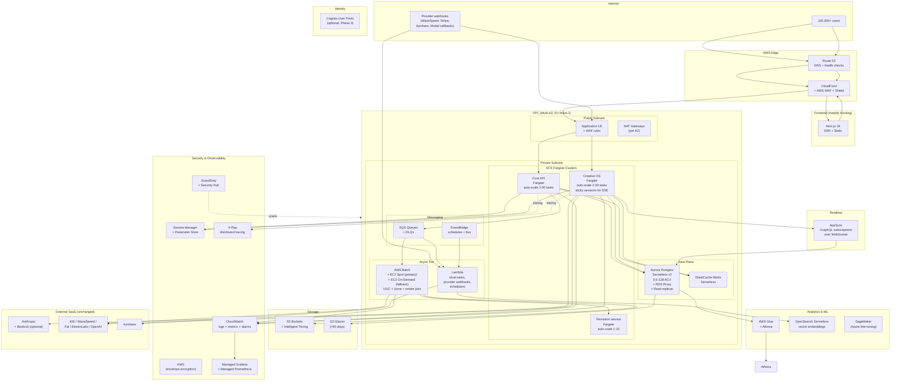

# Aitoma Studio — AWS Migration Architecture
## Reference Design for a Scale-to-100k Production System on AWS

> **Prepared:** May 2026 · **Authors:** Engineering, Aitoma Studio
> **Audience:** AWS Frontier AI team · internal investment committee · technical advisors
> **Scope:** Target architecture, capacity plan, cost model, and phased migration plan
> **Confidentiality:** STRICTLY CONFIDENTIAL
> **Companion documents:** *Technical Architecture & Defensibility (CTO Defense Pack)*, *Tech Architecture Executive Summary*

---

## 0. Executive Summary

Aitoma Studio is currently deployed across Vercel (frontend), Railway (FastAPI services), Modal (serverless workers), Upstash (Redis), and Supabase (Postgres + Storage + Realtime). This composition has carried us through the pre-launch build and the Naiara enterprise deployment. The proposed migration moves the production substrate to AWS in **three deliberate phases** designed to (a) gain AWS Frontier alignment, (b) unlock a credible 100,000-concurrent-user capacity story, (c) maintain operating-cash-positive burn discipline through Y1, and (d) preserve our optionality on every external SaaS dependency we deliberately chose for velocity.

The architecture below is **not a big-bang lift-and-shift**. It is the target state, with a roadmap that lets us migrate compute first (the cheapest and lowest-risk move), data plane second (the most consequential), and edge/auth last (the lowest urgency). At every phase, the system remains fully operational; no migration step requires a maintenance window beyond a DNS cutover.

The architecture is sized to:

- **Y1 base case (7,000 cumulative subscribers, ~700 daily actives, ~250k credit-operations/day):** runs at $3,000–$5,000/month on AWS infra, well within the $25,000 AWS Frontier credit envelope for the first 5–8 months.
- **Y1 upside / Y2 base (16,000+ subscribers):** $5,000–$12,000/month; still cash-positive on €4.9M base ARR.
- **100,000 concurrent users at peak (~Y2 upside / Y3):** $15,000–$30,000/month; gross margin holds at 67–75% per Financials §2.3.

The five-layer moat detailed in *Market & Competition* §5 is preserved unchanged — the model substrate, agent runtime, programmable assembly, performance-attribution dataset, and switching cost layers are all infrastructure-agnostic. Moving to AWS strengthens the **scale story** without altering the **defensibility story**.

---

## 1. Migration Principles

These are the constraints we are optimising against. Every architectural choice below traces to one or more of these.

| # | Principle | Implication |
|---|-----------|-------------|
| 1 | **Compute first, data plane second, edge/auth last** | Compute migration is reversible and low-risk; data plane migration is consequential and irreversible without careful planning; edge/auth migration has low urgency once compute is on AWS |
| 2 | **Managed services over self-managed** | A 4-engineer team should not run its own Kubernetes, its own Redis cluster, its own Postgres replication. We use AWS managed services (Fargate, Aurora, ElastiCache, S3) and pay the AWS premium in exchange for not staffing infrastructure operations |
| 3 | **Spot where it's idempotent, on-demand where it's user-facing** | Worker tier runs on AWS Batch with EC2 Spot (idempotent video jobs); API tier runs on Fargate on-demand (user-visible latency) |
| 4 | **Serverless where it's spiky, container where it's steady** | API gateway, async tools, scheduled posts → Lambda; long-running services (Core API, Creative OS) → Fargate |
| 5 | **Pay for variability, reserve for predictability** | First 6 months on-demand to learn the load shape; Compute Savings Plans + Aurora reserved capacity in Y1 H2 once we have actual utilization data |
| 6 | **Don't migrate what isn't broken yet** | Supabase Postgres + Storage + Realtime + Auth are working today. We move data plane only when AWS-native lets us unlock a capability (vector search, multi-region active-active, etc.) we cannot get from Supabase at acceptable cost |
| 7 | **Preserve all external SaaS optionality** | Anthropic, KIE, WaveSpeed, Fal, ElevenLabs, OpenAI, Ayrshare are SaaS APIs and stay external. AWS Bedrock is an *additional* LLM surface, not a replacement |
| 8 | **Single VPC, single region first** | EU-West-1 (Ireland) initially — 89% of waitlist is Spanish-speaking. Multi-region active-active when revenue justifies it (Y2 H2) |
| 9 | **Treat AWS as a strategic relationship, not a vendor switch** | The Frontier AI engagement, the $25k credits, and the future co-marketing optionality are worth more than the dollar savings of any single migration step |

---

## 2. Current State → Target State Mapping

This is the one-page summary of what changes and what stays. Read this section first; everything that follows is detail.

| Layer | Current | Target (AWS) | When | Why |
|-------|---------|--------------|------|-----|
| **Edge / CDN** | Vercel | CloudFront + S3 + Lambda@Edge<br/>(or **Amplify Hosting**) | Phase 3 (Q1 2027) | Vercel works today; AWS-native edge becomes valuable only at multi-region |
| **Frontend hosting** | Vercel | Amplify Hosting (Next.js 16 SSR) | Phase 3 (Q1 2027) | Native Next.js support; SSR scales horizontally; CloudFront integration |
| **Core API** | Railway (FastAPI) | **ECS Fargate** behind ALB + WAF | Phase 1 (Q3 2026) | Long-running service; auto-scales 1-N tasks; container-native |
| **Creative OS** | Railway (FastAPI) | **ECS Fargate** behind ALB (separate cluster) | Phase 1 (Q3 2026) | Same model; isolation for agent runtime cadence |
| **SSE agent stream** | Long-lived HTTP on Railway | ALB + Fargate with sticky sessions; AppSync subscriptions optional | Phase 1 | Multi-replica friendly via consistent hashing |
| **Async job queue** | Upstash Redis (Celery broker) | **Amazon SQS** + **EventBridge** | Phase 1 (Q3 2026) | Managed, infinite scale, dead-letter queues, retention guarantees |
| **Workers (UGC video, clones, editor render)** | Modal serverless | **AWS Batch** on **EC2 Spot** (with on-demand fallback) | Phase 2 (Q4 2026) | Spot pricing 70-90% cheaper than on-demand; built for batch idempotent workloads |
| **Short async tasks** | Modal serverless | **AWS Lambda** (with `Mangum` for FastAPI compatibility if needed) | Phase 1 (Q3 2026) | Sub-15-min tasks; pay-per-invocation; auto-scales |
| **Remotion renderer** | Modal | **AWS Batch** with Fargate or EC2 spot | Phase 2 (Q4 2026) | Containerized Node service; runs on the same Batch infra |
| **Postgres** | Supabase | **Aurora PostgreSQL Serverless v2** + **RDS Proxy** | Phase 2 (Q1 2027) | Auto-scales 0.5–128 ACU; pgvector for moat dataset; PITR; multi-AZ |
| **Realtime / change feeds** | Supabase Realtime | **AWS AppSync** (GraphQL subscriptions over WebSocket) **OR** keep Supabase Realtime via DB connection | Phase 2 (Q1 2027) | AppSync scales to 1M concurrent WebSocket connections per region |
| **Object storage** | Supabase Storage | **S3** + CloudFront | Phase 2 (Q1 2027) | S3 is the gold standard; Intelligent Tiering for cost; CloudFront for delivery |
| **Auth** | Supabase Auth | **Amazon Cognito** (User Pools + Identity Pools) **OR keep Supabase Auth** | Phase 3 (Q1 2027) | Cognito works but Supabase Auth is feature-equivalent and battle-tested for us — final call deferred |
| **Cache** | (none — Supabase only) | **ElastiCache for Redis (Serverless mode)** | Phase 1 (Q3 2026) | Cluster-mode caching for hot endpoints, session storage, rate limits |
| **Secrets** | Railway env vars | **AWS Secrets Manager** + **Parameter Store** | Phase 1 (Q3 2026) | Rotation; audit; KMS encryption; IRSA-like task roles |
| **Observability** | Railway logs + console.log | **CloudWatch** + **X-Ray** + **Managed Grafana** + **Managed Prometheus** | Phase 1 (Q3 2026) | Centralized; alarms; distributed tracing; dashboards as code |
| **CI/CD** | GitHub Actions → Railway | **GitHub Actions → ECR → ECS** (or **CodePipeline + CodeBuild + ECR**) | Phase 1 (Q3 2026) | Keep GitHub Actions; push images to ECR; ECS deployment via OIDC |
| **DNS + edge security** | Vercel + Cloudflare (current frontend) | **Route 53** + **CloudFront** + **AWS WAF** + **Shield Standard** | Phase 1 (Q3 2026) | Native AWS DNS, edge security, DDoS protection (free at Shield Standard) |
| **Analytics / data warehouse** | Supabase SQL queries | **S3 (raw)** + **Glue** + **Athena** (initially); **Redshift Serverless** if scale demands | Phase 2 (Q1 2027) | Decouple analytics from operational DB; cheap cold storage |
| **Vector store (moat dataset)** | (not yet built) | **OpenSearch Serverless** (vector mode) **OR** pgvector on Aurora | Phase 2 (Q1 2027) | Required for the Q4 2026 "show me ads like this" feature (*Tech DD* §4.1) |
| **LLM inference** | Anthropic + OpenAI direct | **Anthropic + OpenAI direct (primary)** + **AWS Bedrock (additional surface for failover + cost optimization)** | Phase 1 (Q3 2026) | Bedrock exposes Anthropic Claude with AWS billing + private VPC routing |
| **Video generation models** | KIE.ai + WaveSpeed + Fal | **Same (no change)** — external SaaS | n/a | These are model gateway services, not infra; the substrate stays |
| **Distribution** | Ayrshare | **Same (no change)** | n/a | External SaaS by design |
| **Aitoma Scraper** | Separate repo / service | **Same (architecturally separated)** | n/a | Deliberately isolated for platform-countermeasure resilience |

**What we definitively do not migrate:** Anthropic, KIE, WaveSpeed, Fal, ElevenLabs, OpenAI, Ayrshare. These are SaaS APIs whose substrate value is the integration breadth (*Tech DD* §2). AWS-equivalent options exist (Bedrock for LLMs) and we add them as additional surfaces — never as replacements.

---

## 3. Target Reference Architecture

### 3.1 Single-region steady-state topology (EU-West-1, post-Phase 2)



### 3.2 Why this shape, in one paragraph

The architecture has **three independent failure domains** (API tier on Fargate, worker tier on Batch, data plane on Aurora) plus an **edge tier** (CloudFront + Amplify) that fails over to origin gracefully. Compute scales horizontally and independently per service. The data plane scales vertically (Aurora Serverless v2 ACU auto-scaling) and horizontally (read replicas) without manual intervention. The cost shape is **flat to gently increasing** during steady state and **elastic to load spikes** because async workloads ride EC2 Spot. No single component is a hard ceiling at 100,000 concurrent users; the first hard ceiling is the AWS-default 1,000-task-per-cluster Fargate limit, which is a soft limit easily raised by support ticket before we need it.

---

## 4. Service-by-Service Design

### 4.1 Frontend — Amplify Hosting + CloudFront

**Today:** Vercel, single deploy, automatic optimization.

**Target:** AWS Amplify Hosting (Next.js 16 native support, SSR + static, automatic CloudFront integration) with CloudFront origin failover to S3-hosted static fallback.

| Decision | Rationale |
|----------|-----------|
| **Amplify over manual S3 + Lambda@Edge** | Amplify supports Next.js 16 SSR natively (App Router, server components, ISR). DIY S3+Lambda@Edge would require us to maintain build pipelines and SSR shims |
| **CloudFront everywhere** | 450+ POPs globally, automatic gzip/Brotli, HTTP/3, signed URLs for asset protection |
| **AWS WAF + Shield Standard** | Free DDoS protection + managed rule groups for OWASP Top 10 + custom rate-limit rules per IP/JWT |
| **Origin failover** | Primary: Amplify SSR; Fallback: S3 static export bucket. CloudFront automatically routes to fallback on 5xx |

**Capacity:** CloudFront handles billions of requests/day natively. The Next.js SSR origin (Amplify) auto-scales but should be sized for ~10% of CloudFront request volume (most traffic is cache-hit). At 100k concurrent users assuming 10% are actively rendering server-side pages → ~10k req/s peak to Amplify SSR — easily within Amplify's scale envelope.

### 4.2 API Tier — ECS Fargate behind Application Load Balancer

**Today:** Single-replica Railway services (Core API on :8000, Creative OS on :8001).

**Target:**

| Service | Cluster | Task definition | Auto-scaling | Target metric |
|---------|---------|----------------|--------------|---------------|
| **Core API** | `aitoma-core-api` | 1 vCPU, 2 GB | 2–50 tasks | 70% avg CPU + 70% avg memory + ALB request count |
| **Creative OS** | `aitoma-creative-os` | 2 vCPU, 4 GB | 2–30 tasks | 70% CPU + concurrent SSE connections per task |
| **Remotion service** | `aitoma-remotion` | 2 vCPU, 4 GB | 1–10 tasks | SQS queue depth (or Fargate request count) |

**ALB configuration:**

- **HTTPS only** (cert via ACM)
- **Path-based routing**: `/api/*` → Core API target group; `/creative-os/*` → Creative OS target group
- **Sticky sessions enabled on Creative OS target group** (cookie-based; required for SSE long-poll stability mid-stream)
- **Health checks**: `/health` on each service; 2 healthy / 2 unhealthy thresholds; 10s interval
- **Slow-start mode** on Fargate task registration (60s warm-up before full traffic)

**Why Fargate over EKS:** EKS is the right choice at 50+ services. We have 3 services. Fargate is fully managed, no node management, no Kubernetes operational overhead — perfect for a 4-engineer team. We can migrate to EKS at Series A if our service count justifies it; until then, Fargate is the right cost-velocity trade.

**Why not App Runner:** App Runner is simpler but lacks fine-grained scaling controls and per-task IAM roles that we need for cross-service authorization. Fargate is one step more sophisticated for very little additional operational cost.

### 4.3 Agent SSE Streaming — Sticky Fargate + AppSync Option

The SSE stream from `/creative-os/agent/stream` is the **most stateful endpoint in the system**. A 5-minute agent turn must stay pinned to one Fargate task because:

1. The Anthropic streaming session is held in process
2. The `asyncio.Lock` for per-project concurrency is per-process (today)
3. Tool execution state (the 120s fingerprint dedup, the confirmation stash) is in-process

**Two complementary strategies:**

#### Strategy A (Phase 1) — Sticky sessions on ALB

- Enable session affinity on the Creative OS target group (cookie-based)
- Per-project lock remains in-process (current design)
- Acceptable up to ~5,000 concurrent agent sessions per region (well above Y1 needs)

#### Strategy B (Phase 2, when needed) — Redis-backed lock + ElastiCache + AppSync for non-agent push

- Move the `asyncio.Lock` to a Redis-backed lock in ElastiCache (`redis-py-cluster` lock primitive)
- Move agent session state out of process (cache Anthropic session IDs in ElastiCache, hydrate on any replica)
- Replace SSE with **AppSync GraphQL subscriptions over WebSocket** for non-token-by-token push notifications (job complete, async-image landed, schedule confirmed)
- Keep SSE for the literal token stream from Anthropic, but allow it to break-and-reconnect on any replica

**AppSync limits:** 1,000,000 concurrent WebSocket connections per AWS account per region (soft limit). At 100k concurrent users with maybe 30% holding an active editor session = 30,000 WebSocket connections, comfortably under threshold.

### 4.4 Worker Tier — AWS Batch on EC2 Spot (with Fallback)

**Today:** Three-tier dispatch (Modal → Celery → in-process thread).

**Target:** Three-tier dispatch preserved, but the tiers are:

| Tier | Replaces | AWS Service | Cost profile |
|------|----------|-------------|--------------|
| 1 | Modal | **AWS Batch + EC2 Spot** | 70–90% cheaper than on-demand; ideal for idempotent video jobs with built-in retry |
| 2 | Celery via Redis | **AWS Batch + EC2 On-Demand** | Spot interruption fallback; same Batch job definition, different compute environment |
| 3 | In-process | **ECS Fargate (in API container)** | Last resort if Batch is unavailable — same code path as today |

**Three-tier failover preserved at AWS:**

```python
# Equivalent of ugc_backend/main.py:59-129, target state:
def _dispatch_worker(job_id: str) -> bool:
    # Tier 1: Submit to AWS Batch (EC2 Spot pool)
    if submit_to_batch(job_id, queue="ugc-spot"):
        return True
    # Tier 2: Submit to AWS Batch on-demand pool
    if submit_to_batch(job_id, queue="ugc-ondemand"):
        return True
    # Tier 3: In-process (Fargate task itself runs the job)
    return run_in_thread(job_id)
```

**Batch configuration:**

| Parameter | Value |
|-----------|-------|
| **Compute environment 1 (Spot)** | EC2 Spot, m6i/r6i instances, 1–500 vCPUs, MaxPrice = 60% of on-demand, allocation strategy `SPOT_PRICE_CAPACITY_OPTIMIZED` |
| **Compute environment 2 (On-Demand)** | EC2 On-Demand, same instance family, 0–200 vCPUs, allocation strategy `BEST_FIT_PROGRESSIVE` |
| **Job queue** | `ugc-jobs` with priority routing: Spot CE first, On-Demand second |
| **Job definition** | Container image from ECR; environment variables from Secrets Manager; CloudWatch Logs |
| **Retry** | `attemptDurationSeconds=1800` (30 min); `attempts=3`; retry only on EXIT codes that match transient errors |
| **Concurrency** | No explicit limit; SQS queue depth + IAM throttling provides backpressure |

**GPU readiness:** When InfiniteTalk or future on-prem inference justifies GPU, swap one Batch CE to `g6.xlarge` or `g6e.xlarge` (L4 / L40S GPUs). Same job-submission code; only CE selector changes.

**Cost example (Y1 base case):** ~10,000 video jobs/day × ~5 min each × 2 vCPU = ~1,700 vCPU-hours/day. At Spot ~$0.02/vCPU-hour = **~$1,000/month** for the entire UGC worker pool. This is dramatically lower than equivalent Modal pricing.

### 4.5 Short Async Tasks — AWS Lambda

**Today:** `asyncio.create_task` inside Creative OS process; in-process daemon threads for tracker pollers.

**Target:** AWS Lambda for any task that:

1. Runs in < 15 minutes
2. Is idempotent (or has explicit dedup)
3. Doesn't need shared in-process state

| Task | Trigger | Function memory |
|------|---------|----------------|
| KIE / WaveSpeed result poller | EventBridge (cron) or SQS message | 256 MB |
| Provider webhook handler | API Gateway / ALB | 512 MB |
| Ayrshare schedule executor | EventBridge cron (every 5 min) | 512 MB |
| Stripe webhook handler | API Gateway | 256 MB |
| Async-image dispatcher | SQS message | 512 MB |
| Campaign-watcher tick | EventBridge cron (every 30s) | 1 GB |

**Why Lambda instead of Fargate for these:** zero cost when idle (Lambda free tier covers most of these at our volume), millisecond cold start with provisioned concurrency, automatic scaling to AWS account concurrency limit (default 1,000 concurrent Lambdas, raisable). At Y1 base case our Lambda spend is **< $50/month**.

### 4.6 Queue & Event Bus — SQS + EventBridge

**Today:** Upstash Redis as Celery broker.

**Target:**

| Concern | AWS service | Replaces |
|---------|-------------|----------|
| Job queue (UGC, clone, editor render) | **SQS Standard** with per-tenant message attributes | Celery broker |
| Dead-letter queue | **SQS** as DLQ on each main queue | Manual handling |
| Scheduled task firing | **EventBridge Scheduler** (cron, one-shot) | Celery beat |
| System events (campaign created, job succeeded, etc.) | **EventBridge default bus** | Internal pub/sub |
| Fan-out (one event, many consumers) | **EventBridge rules** + **SNS** | Custom code |

**Why SQS over keeping Upstash Redis:**

- **Infinite retention** (up to 14 days) vs. Redis ephemeral storage
- **Native DLQ** without writing dead-letter routing logic
- **Automatic visibility timeout** for "in-flight" semantics (replaces our custom stale-recovery logic)
- **Per-message tracing** in X-Ray
- **Cost at our scale:** $0.40 per million messages; at 1M messages/day = **$12/month** vs. ~$30/month Upstash Pro

**SQS-Batch integration:** SQS queue triggers Batch jobs natively via EventBridge Pipes. This is the cleanest implementation of "queue depth → spawn worker" and entirely managed.

### 4.7 Data Plane — Aurora PostgreSQL Serverless v2

This is the most consequential migration decision. **Aurora PostgreSQL Serverless v2 is the right target.** Justification:

| Property | Aurora Serverless v2 | Supabase | Why it matters |
|----------|---------------------|----------|----------------|
| **Compute scaling** | 0.5–128 ACU (auto, ~250ms granularity) | Standard/Pro tiers, manual upgrade | Pay only for what we use; auto-scales to peaks |
| **Storage scaling** | Auto, up to 128 TB | Auto, plan-dependent | Equivalent |
| **Multi-AZ** | Built-in (synchronous replication) | Built-in | Equivalent |
| **Read replicas** | Up to 15, ms lag | Read replicas via Supavisor | Aurora is more elastic |
| **PITR** | Up to 35 days | 7 days standard | Aurora more robust |
| **pgvector** | Native (Postgres 15+) | Available | Equivalent (both support vector embeddings) |
| **Connection pooling** | **RDS Proxy** (managed) | Supavisor (managed) | Equivalent |
| **Realtime / change feeds** | DMS + Kinesis, or AppSync over Postgres LISTEN | Built-in Realtime | Supabase wins on simplicity here |
| **Cost at low utilization** | Pay-per-ACU-second | Flat-fee tiers | Aurora wins when off-peak |
| **Cost at high utilization** | ACU-hour pricing | Tier-based | Aurora wins when fine-grained scaling matters |
| **Auth integration** | None (use Cognito / Supabase Auth) | Built-in | Supabase wins |

**Decision:** Aurora is the right target for the data plane, but we **keep Supabase Realtime + Supabase Auth as long as possible** because they are genuinely better integrated for our access patterns. The migration is **Postgres-only** in Phase 2; Realtime and Auth remain Supabase until we have an operational reason to move them.

**Connection pooling:** RDS Proxy in front of Aurora. Application services connect to the proxy with 1,000+ "client" connections; the proxy multiplexes to 100 actual Aurora connections. This unlocks horizontal scaling of Fargate tasks without exhausting Aurora's connection limit.

**Schema migration:** All 28 numbered migrations + base SaaS tables + Stripe migrations apply cleanly on Aurora (it's PostgreSQL 15+). We test the migration in a staging environment for 4 weeks before cutting over. Cutover itself is:

1. Enable logical replication from Supabase → Aurora via AWS DMS
2. Wait for replication lag < 1 second sustained
3. Stop application writes for ~30 seconds during cutover
4. Promote Aurora to primary; update application connection strings
5. Resume traffic

Total downtime: ~30–60 seconds. Done at low-traffic hour (3am CET).

### 4.8 Object Storage — S3 + CloudFront

| Property | Setup |
|----------|-------|
| **Buckets** | `aitoma-{env}-assets-eu-west-1`, `aitoma-{env}-private-eu-west-1`, `aitoma-{env}-analytics-eu-west-1` |
| **Lifecycle** | Intelligent Tiering on assets bucket (auto-tier to IA after 30 days, Glacier after 90); analytics bucket → Glacier Deep Archive after 180 days |
| **Versioning** | On for private bucket (audit + recovery); off for assets bucket (cost) |
| **Encryption** | SSE-S3 default; SSE-KMS for private bucket |
| **CORS** | Restricted to known Aitoma domains for client uploads |
| **CloudFront origin** | Origin Access Control (OAC) so S3 never serves directly — only via CloudFront with signed URLs for protected content |
| **Signed URLs** | 1-hour expiry for client downloads; 5-minute expiry for upload pre-signs |

**Cost at Y1 base case:** ~50 TB stored × $0.023/GB = **$1,200/month** for storage; ~10 TB egress × $0.085/GB = **$850/month**. CloudFront caching cuts egress to ~30% of raw. Total storage tier: **~$1,500/month**.

### 4.9 Realtime — Keep Supabase or Move to AppSync (TBD)

Migration not urgent. Current realtime use is minimal (`async_image_jobs` push notifications in `JobTray.tsx`). Two paths:

1. **Keep Supabase Realtime** (zero migration cost) — works fine until we have multi-region needs or want AWS-native consolidation
2. **Move to AppSync GraphQL subscriptions** — required if we want to push from any AWS Lambda or Fargate task to clients without round-tripping through Supabase

We defer this decision to Phase 2; the migration is small (200-300 lines of frontend + Lambda glue) and can be done in 1 week when needed.

### 4.10 Auth — Cognito or Keep Supabase Auth

Supabase Auth works today. Moving to Cognito has costs (re-issuing JWTs, migrating user pool, updating every `Depends(get_current_user)` in our Python code, updating the frontend `@supabase/ssr` to `aws-amplify/auth`). The benefit is consolidation under AWS billing.

**Recommendation:** Defer until Phase 3 (Q1 2027). At that point we evaluate Cognito vs. continuing Supabase Auth based on (a) Supabase pricing at Y1 actual usage, (b) Cognito User Pool feature parity with our patterns, (c) cost of the migration vs. the consolidation benefit. We do not commit either way today.

### 4.11 Observability — CloudWatch + X-Ray + Managed Grafana

**Today:** Railway logs + console.log + Modal dashboard.

**Target:**

| Layer | Tool |
|-------|------|
| **Logs** | CloudWatch Logs (structured JSON via `structlog`); 30-day retention by default, 1-year for audit logs |
| **Metrics** | CloudWatch Metrics (auto from Fargate, ALB, Aurora, Lambda); custom metrics from app via `embedded metric format` (EMF) |
| **Distributed tracing** | AWS X-Ray (auto-instrumentation via boto3 / FastAPI middleware); request flows traced end-to-end across Fargate → Lambda → Batch |
| **Dashboards** | Amazon Managed Grafana (workspaces); pre-built dashboards for: Job lifecycle, Provider routing health, Agent stream metrics, Cost per generation |
| **Alarms** | CloudWatch Alarms → SNS → PagerDuty integration; defined as code via Terraform/CDK |
| **Cost monitoring** | CloudWatch + AWS Cost Explorer + AWS Budgets with anomaly detection; weekly cost-by-service email |

**Critical alarms to define on day 1:**

| Alarm | Threshold |
|-------|-----------|
| Core API p95 latency > 2s for 5 min | Page on-call |
| Aurora CPU > 80% for 10 min | Page on-call |
| SQS DLQ message count > 0 | Slack notification |
| Batch job failure rate > 5% over 30 min | Slack notification |
| Anthropic provider error rate > 5% over 10 min | Slack notification (triggers manual failover review) |
| Monthly spend > budget × 1.1 | Email + Slack |

### 4.12 Security & Compliance

| Concern | Implementation |
|---------|----------------|
| **Network isolation** | Single VPC; public subnets for ALB + NAT only; private subnets for everything else; VPC endpoints for S3/SQS/Secrets to avoid NAT cost |
| **Secrets** | Secrets Manager for API keys (Anthropic, KIE, WaveSpeed, etc.); auto-rotation where supported (DB credentials); IAM task roles for service-to-service auth (no static keys) |
| **Encryption at rest** | KMS with customer-managed keys for: Aurora, S3 private, Secrets Manager, EBS volumes |
| **Encryption in transit** | TLS 1.2+ everywhere via ACM certs; mTLS optional for service-to-service in Phase 3 |
| **DDoS protection** | AWS Shield Standard (free, automatic); AWS WAF with rate-limit rules |
| **Audit** | CloudTrail org-trail to dedicated S3 bucket with cross-account replication; Athena queries over CloudTrail logs |
| **Threat detection** | GuardDuty (managed threat intelligence) + Security Hub for finding aggregation |
| **Compliance posture** | AWS Config rules enforcing security baseline; AWS Audit Manager for SOC 2 path (Q3 2027 alignment) |
| **Multi-tenant data isolation** | App-layer enforcement (current model) + Aurora row-level security policies (mirror of current Supabase RLS) |

---

## 5. 100,000 Concurrent User Capacity Plan

This is the section the AWS Frontier team will most want to see. We size every component with explicit math.

### 5.1 Definitions

- **Concurrent users:** users with an open Aitoma Studio tab and an active session (not just logged-in customers)
- **Active users:** users making one or more API requests in the current minute
- **Generation jobs/sec:** distinct UGC video / clone / image generation jobs initiated per second
- **Agent sessions:** users with an open chat panel and an active SSE connection

### 5.2 Load profile at 100k concurrent

| Activity | Rate (estimated, conservative) |
|----------|-------------------------------|
| Active users (1-min) | ~25% of concurrent = 25,000/min |
| API requests/sec (dashboard, gallery, etc.) | ~10 req/user/min × 25k = **~4,200 req/s** |
| Concurrent agent SSE streams | ~10% of concurrent = **10,000 streams** |
| Generation jobs/sec | ~1 job/user/hour × 100k = ~28/sec **peak ~50/sec** |
| Concurrent video renders in flight | ~50/s × 5 min avg = ~15,000 concurrent renders |
| Aurora read QPS | ~30 reads/API call × 4,200 = ~125,000/sec (90% cached) → ~12,500/sec to DB |
| Aurora write QPS | ~5 writes/API call × 4,200 = ~21,000/sec (mostly via async job state updates) → ~3,000/sec to DB |
| Realtime push events/sec | ~50 jobs/s × 5 events/job = **~250 push events/sec** |
| S3 GET (asset delivery) | ~95% CloudFront cache hit → ~200 origin GETs/sec |
| S3 PUT (job outputs) | ~50 PUTs/sec |

### 5.3 Component sizing

| Component | Sizing | Cost at peak |
|-----------|--------|--------------|
| **CloudFront** | Native scale; no capacity planning needed | ~$500/month at 100k concurrent (mostly egress) |
| **Amplify SSR** | Auto-scaling; ~10 concurrent instances at peak | ~$300/month |
| **Core API (Fargate)** | 30–50 tasks × 1 vCPU × 2 GB; ~4,200 req/s ÷ ~150 req/s per task = 30 tasks | ~$2,000/month |
| **Creative OS (Fargate)** | 20–30 tasks × 2 vCPU × 4 GB; sticky for SSE | ~$2,500/month |
| **Lambda (async tasks + webhooks)** | ~10M invocations/month; 256 MB avg; ~50 ms avg | ~$200/month |
| **AWS Batch (Spot UGC pool)** | ~15,000 concurrent renders × 2 vCPU = 30,000 vCPU; m6i.4xlarge spot @ ~$0.16/hr = ~$1,500/hr peak; avg ~30% utilization | ~$5,000/month |
| **AWS Batch (On-demand fallback)** | 10% capacity, on-demand pricing | ~$1,000/month |
| **Aurora Serverless v2** | Scales 16–48 ACU at peak; 8 ACU steady; ~$0.12/ACU-hr | ~$3,000–$5,000/month |
| **RDS Proxy** | Pricing follows Aurora; ~$50/month | ~$50/month |
| **ElastiCache Serverless** | ~10 GB cache; scales auto; ~$0.125/GB-hr peak | ~$500/month |
| **AppSync** | $4/million queries + $2/million minutes connection time; ~3M minutes/month | ~$300/month |
| **SQS** | ~30M messages/month at $0.40/M | ~$15/month |
| **EventBridge** | ~1M events/month + scheduler | ~$15/month |
| **S3** | ~150 TB stored (with Intelligent Tiering); ~30 TB egress (after CloudFront caching) | ~$3,000/month |
| **Route 53 + CloudWatch + X-Ray + WAF + GuardDuty + Secrets Manager** | Misc managed services | ~$600/month |
| **NAT Gateway** | ~$50/month + data | ~$200/month |
| **TOTAL** | | **~$19,000–$24,000/month at 100k concurrent peak** |

**Important context:** 100k *concurrent* users translates to a much larger paying subscriber base (~500k–1M, since average session-per-month per user is well under 1.0 concurrent). At 500k paying subscribers × €69 ARPU = €34.5M ARR. $24k/month AWS infra against €2.9M monthly revenue = **0.8% of revenue** — institutional-grade SaaS infrastructure cost ratio.

### 5.4 Where the bottlenecks actually are

In order of when they appear as we scale up:

| Scale | First bottleneck | Mitigation |
|-------|------------------|------------|
| 10k concurrent | Anthropic rate limits | AWS Bedrock for Anthropic + retry router (already implemented) |
| 30k concurrent | Aurora connection count | RDS Proxy (in design) |
| 50k concurrent | Fargate cluster default task limit | Raise limit via support ticket (one ticket) |
| 80k concurrent | CloudFront cache key complexity | Cache policy tuning |
| 100k concurrent | NAT Gateway throughput per AZ (45 Gbps) | Multiple NAT Gateways per AZ + VPC endpoints for AWS services |
| 200k concurrent | Single-region failure radius | Multi-region active-active (Phase 4, post-Series A) |

**None of these is a hard ceiling.** Each has a known mitigation that scales us to the next level.

---

## 6. Cost Model & Burn Optimization

### 6.1 AWS cost vs. current spend

| Stage | Current monthly | Target monthly | Delta |
|-------|----------------|----------------|-------|
| **Today (pre-launch)** | ~€200 (Railway + Supabase + Modal + Upstash + Vercel) | n/a | n/a |
| **Y1 base case (7k subs)** | €1,000-€2,500 (scaling current) | $3,000-$5,000 on AWS | Slight increase; offset by Frontier credits |
| **Y1 upside / Y2 base (16k subs)** | €2,500-€5,000 | $5,000-$12,000 on AWS | Comparable; AWS gives elasticity |
| **Y2 upside / Y3 base (32k subs)** | €6,000-€12,000 | $10,000-$20,000 on AWS | Comparable; AWS unlocks features |
| **100k concurrent peak (Y3 upside)** | n/a (current stack would break) | $19,000-$24,000 | AWS only |

### 6.2 Where the AWS Frontier $25,000 credit goes

| Period | Spend covered |
|--------|---------------|
| Months 1-3 (Phase 1 migration: compute) | ~$10,000 — covers all compute migration testing and initial production |
| Months 4-6 (Phase 2 begins: data plane) | ~$10,000 — covers Aurora staging environment and 30-day pilot |
| Months 7-8 (Phase 2 cutover) | ~$5,000 — covers cutover risk + parallel run |

**The credit envelope is engineered to cover the migration period precisely.** At the end of the credit window we are operating on AWS at a known cost structure.

### 6.3 Cost-engineering practices (built in from Day 1)

| Practice | Annual savings (estimated, at Y2 base) |
|----------|----------------------------------------|
| **EC2 Spot for AWS Batch** (70–90% off on-demand) | ~$30,000-$50,000 |
| **Aurora Serverless v2 auto-pause** for staging/dev | ~$8,000 |
| **S3 Intelligent Tiering** | ~$5,000 |
| **CloudFront caching reducing S3 egress** | ~$10,000 |
| **VPC endpoints reducing NAT data charges** | ~$3,000 |
| **Lambda for spiky tasks vs. always-on Fargate** | ~$5,000 |
| **Reserved Instances / Savings Plans** (Y1 H2, after baseline data) | ~$15,000-$25,000 |
| **AWS Trusted Advisor + Cost Anomaly Detection** alerts | (preventative) |
| **Weekly cost-by-service review meeting** | (governance) |

Total expected savings vs. naive on-demand sizing: **~$75,000-$100,000/year by Y2** — material for a venture-backed SaaS at our stage.

### 6.4 Burn discipline guardrails

1. **AWS Budgets with anomaly detection** on every account; alerts at 80%, 100%, 120% of monthly budget
2. **Cost Allocation Tags** on every resource (`Environment`, `Service`, `Customer-Tier`) so cost-by-feature is queryable
3. **Quarterly cost-vs-revenue review** on engineering OKRs
4. **No new AWS service adoption without a written justification + cost estimate** (prevents service sprawl)

---

## 7. Phased Migration Plan

We migrate in three phases. Each phase is **reversible until the cutover step** so we can abort if AWS-native is not delivering the expected benefit.

### Phase 1 — Compute Migration (Q3 2026, 6 weeks)

| Week | Work | Risk level |
|------|------|------------|
| 1 | AWS account setup, VPC, IAM, ECR, observability baseline | Low |
| 2 | Containerize Core API and Creative OS (Dockerfiles, multi-stage builds, image size optimization) | Low |
| 3 | Deploy Core API to ECS Fargate in staging; test against current Supabase | Low |
| 4 | Deploy Creative OS to ECS Fargate in staging; configure ALB sticky sessions for SSE | Medium |
| 5 | Migrate workers to AWS Batch in staging (Spot pool); verify Modal-equivalent throughput | Medium |
| 6 | Production cutover via DNS routing (10% → 50% → 100% over 5 days); decommission Railway/Modal | Medium |

**Exit criteria:** All compute on AWS; Supabase data plane unchanged; AWS Frontier credit consumption tracking on plan.

### Phase 2 — Data Plane Migration (Q1 2027, 8 weeks)

| Week | Work | Risk level |
|------|------|------------|
| 1-2 | Aurora Serverless v2 cluster in staging; RDS Proxy; full schema migration apply | Low |
| 3-4 | Set up AWS DMS logical replication Supabase → Aurora; verify data parity | Medium |
| 5-6 | Application-side connection-string toggle gated by feature flag; test in staging with full read/write through Aurora | Medium |
| 7 | 30-day parallel-write soak test (writes go to both Supabase and Aurora; reads compared for divergence) | Medium |
| 8 | Cutover: stop Supabase writes for ~30 seconds, promote Aurora to primary, resume traffic; keep Supabase as read-only fallback for 7 days | High |

**Exit criteria:** Aurora is primary; Supabase Postgres retired (Auth and Realtime may continue if cost-effective); all monitoring on CloudWatch.

### Phase 3 — Edge & Auth (Q2 2027, 4 weeks)

| Week | Work | Risk level |
|------|------|------------|
| 1 | Amplify Hosting setup; staging deploy of Next.js; CloudFront origin failover config | Low |
| 2 | Production frontend cutover via DNS (Vercel → Amplify) | Low |
| 3 | Cognito User Pool setup (optional, depending on Supabase Auth cost at scale); user migration tooling | Medium |
| 4 | Decommission Vercel; archive Supabase project | Low |

**Exit criteria:** Single-vendor AWS production environment; Supabase fully decommissioned; cost baseline locked in for Y2.

### Phase 4 — Multi-Region (Y2 H2, post-Series A)

Active-active EU-West-1 + US-East-1 + AP-Southeast-1 (Singapore). Requires Aurora Global Database, CloudFront edge-aware routing, multi-region S3 replication. Estimated 12-week project; activated when revenue justifies (~$10M+ ARR).

---

## 8. What We Keep (And Why)

| Component | Why we don't migrate |
|-----------|---------------------|
| **Anthropic Claude** | Our model substrate is a deliberately external SaaS. AWS Bedrock provides Anthropic access as well, and we will use Bedrock as an **additional surface** (for VPC-private routing and consolidated billing) but never as the only Anthropic path. Failover between direct Anthropic API and Bedrock-Anthropic is a routing decision, not a vendor switch |
| **KIE.ai + WaveSpeed + Fal** | These are video model gateways with curated access to Veo, Kling, Seedance, NanoBanana, InfiniteTalk. AWS Bedrock does not currently serve these. Our model agnosticism *depends* on these providers existing alongside Bedrock |
| **ElevenLabs + OpenAI** | Same reasoning; ElevenLabs voices are our brand-voice substrate and OpenAI Whisper is our transcription standard. AWS Polly / AWS Transcribe are technically equivalent but switching trades 6 months of prompt tuning for ~10% cost savings — bad trade today |
| **Ayrshare** | Social distribution SaaS. AWS does not have a comparable. Stays external |
| **Aitoma Scraper** | Separate repo, separate runtime, deliberately isolated for platform-countermeasure resilience. May run on AWS (Fargate / Lambda) for compute consolidation, but never merges into the main application |
| **GitHub** | Source control + CodeBuild via OIDC. No reason to move to CodeCommit |
| **Stripe** | Payments substrate. No AWS equivalent |

---

## 9. Risks & Mitigations

| Risk | Likelihood | Impact | Mitigation |
|------|-----------|--------|------------|
| **Migration takes longer than planned** | Medium | Medium | Phases are reversible; we can pause between phases without code churn |
| **AWS spend exceeds Frontier credits before Phase 2 completes** | Medium | High | Weekly cost reviews; tighter ECR / NAT / Spot config from Day 1; Phase 2 deferrable by 3 months if needed |
| **Aurora Serverless v2 cold-start latency hurts SSE** | Low | Medium | Aurora ACU min set to 2 (always-warm); RDS Proxy connection pooling; staging soak test catches this |
| **Vendor lock-in to AWS limits future negotiation** | Low | Low | Architecture uses portable patterns (ECS Fargate ≈ GCP Cloud Run ≈ Azure Container Apps); data is in S3 + Postgres standard SQL |
| **Engineering team learning curve on AWS** | Medium | Medium | Two engineers attend AWS Skill Builder courses pre-Phase 1; AWS Solutions Architect engagement during Phase 1 (Frontier offer typically includes this) |
| **DDoS during high-publicity moment (launch / Capital Club push)** | Low | High | AWS Shield Standard + WAF managed rules + CloudFront global distribution. Optional: Shield Advanced ($3k/month) at Y2 if traffic patterns justify |
| **Cost overrun under spiky load** | Medium | Medium | Per-customer rate limits at ALB; Lambda concurrency caps; Batch queue prioritization; cost anomaly alerts trigger before invoice |
| **Cutover failure on data plane** | Low | Very High | Parallel-write soak test; 7-day read-only fallback on Supabase post-cutover; well-rehearsed rollback runbook |
| **Loss of Supabase Realtime simplicity** | Medium | Low | Defer Realtime migration to Phase 3; option to keep Supabase Realtime indefinitely if AppSync is overkill |

---

## 10. AWS Frontier Engagement — Specific Asks

For the AWS Frontier AI conversation, we are explicitly asking for:

1. **$25,000 in AWS service credits** — covers Phase 1 (compute migration) + Phase 2 staging + 30-day parallel-run for data plane cutover
2. **Solutions Architect engagement** — 4–6 weeks of part-time SA support during Phase 1 to validate the reference architecture, review the Aurora cutover plan, and pressure-test our 100k-user capacity model
3. **AWS Activate Founders package** — $1k Business Support credits + additional credits per the Activate program
4. **Bedrock Anthropic access** with our existing Anthropic enterprise terms preserved — we want to use Bedrock as an additional Anthropic surface for VPC-private routing without re-negotiating Anthropic pricing
5. **Co-marketing opportunity** post-launch — Aitoma Studio is a category-relevant AI application company; we welcome the AWS Frontier case-study and AWS Summit speaking opportunities once Phase 1 is in production
6. **Connection to AWS Partners** for SageMaker / OpenSearch Serverless deployment of our moat-dataset vector index when Phase 2 reaches that point
7. **Discounted Aurora Serverless v2 reserved capacity** once we have 6 months of utilization data (Y1 H2)
8. **Engagement with AWS Bedrock product team** on potential future inclusion of KIE / WaveSpeed-equivalent video models in Bedrock — if AWS prioritizes video-model bring-your-own surfaces, we are an ideal pilot customer

We are **not** asking for:

- A discount on the Anthropic API pricing we already negotiate directly with Anthropic
- A managed-Kubernetes engagement (we deliberately do not need EKS at our stage)
- Co-development of any AWS-proprietary IP
- Exclusivity on any AWS service in exchange for credits

---

## 11. What This Architecture Enables (Strategic)

Migrating to AWS is not only an operational decision. It unlocks five strategic capabilities tied to our roadmap:

| Capability | Roadmap item | Why AWS matters |
|-----------|--------------|----------------|
| **Vector similarity for "show me ads like this"** | *Tech DD* §4.1 Q4 2026 | OpenSearch Serverless (vector) or Aurora pgvector — both AWS-native, faster integration than alternatives |
| **A/B framework with deterministic variants** | *Tech DD* §4.1 Q4 2026 | EventBridge + Athena + SageMaker for experiment tracking and winner promotion at scale |
| **Per-customer brand voice memory** | *Tech DD* §4.1 Q1 2027 | OpenSearch Serverless (vector) for brand-voice retrieval; Bedrock fine-tuning surface for brand-locked director profiles |
| **Native Meta Ads Library + TikTok Ads Manager integrations** | *Tech DD* §4.1 Q2 2027 | AWS PrivateLink + API Gateway provide enterprise-grade integration surfaces |
| **Enterprise SSO + audit logs + RBAC** | *Tech DD* §4.1 Q3 2027 | Cognito enterprise federation + AWS Organizations + CloudTrail give us the SOC 2 trajectory without building it ourselves |

In other words: the AWS migration is **also a moat-acceleration migration**, not just an infrastructure upgrade. Three of the moat-compounding roadmap items above are materially faster on AWS than on our current stack. We get to ship the moat-deepening features faster, while operating at a lower cost-per-customer than competitors who built on opinionated PaaS substrates.

---

## 12. Decision Summary for the Boardroom

| Question | One-line answer |
|----------|----------------|
| **Why migrate at all?** | Strategic alignment with AWS Frontier ($25k credits + SA engagement + co-marketing), unlocks 100k-user capacity story for Y3 plan, accelerates three moat-compounding roadmap items, future-proofs the platform for the AWS-native enterprise buyer |
| **Why now?** | Phase 1 is 6 weeks of work that fits within the Q3 2026 launch quarter; doing it before public launch means we never operate Vercel-Railway-Modal at scale (cheaper) |
| **Why this architecture and not a simpler one?** | Every component chosen has a managed-service equivalent that doesn't require a dedicated SRE; the architecture is "as simple as possible while supporting 100k concurrent and being honest about failure domains" |
| **Why not EKS / Kubernetes?** | We have 3 services, not 30. EKS adds operational cost without proportional benefit until our service count justifies it |
| **Why preserve the external SaaS dependencies?** | Anthropic, KIE, WaveSpeed, Fal, etc. are the model substrate. The substrate **is** the moat. Replacing them is the opposite of model agnosticism |
| **What if AWS itself has an outage?** | Multi-AZ by default. Multi-region in Phase 4 (post-Series A). Until then, AWS regional availability (4+ 9s) is acceptable risk |
| **What's the cost ceiling at 100k users?** | ~$24k/month, against ~€2.9M/month revenue at that scale (0.8% of revenue) — institutional-grade SaaS infrastructure ratio |
| **What if AWS Frontier doesn't fund the credits?** | Phase 1 still makes sense without credits ($5-8k AWS spend over 6 weeks is within our existing operating budget); we'd just defer Phase 2 by one quarter |

---

## 13. Appendix A — Architecture Decision Records (ADR) Index

The following ADRs are drafted and will be committed to the repo at `docs/adr/` as Phase 1 begins. They capture the *why* behind each decision for future engineers and auditors.

| # | Title | Decision |
|--:|-------|----------|
| 001 | Compute platform: Fargate vs. EKS vs. App Runner | Fargate |
| 002 | Worker platform: AWS Batch + Spot vs. Modal vs. Lambda | Batch + Spot (primary), Lambda for sub-15-min tasks |
| 003 | Data plane: Aurora Serverless v2 vs. RDS vs. keep Supabase | Aurora Serverless v2 |
| 004 | Cache: ElastiCache Serverless vs. self-managed Redis | ElastiCache Serverless |
| 005 | Auth: Cognito vs. keep Supabase Auth | Defer (re-evaluate Phase 3) |
| 006 | Realtime: AppSync vs. keep Supabase Realtime | Defer (re-evaluate Phase 3) |
| 007 | Frontend hosting: Amplify vs. CloudFront+S3+Lambda@Edge vs. keep Vercel | Amplify (Phase 3) |
| 008 | LLM access: Direct Anthropic API + Bedrock vs. Bedrock only | Both, as a routing decision |
| 009 | IaC: Terraform vs. CDK vs. CloudFormation | Terraform (existing engineer familiarity + multi-cloud option) |
| 010 | Region: EU-West-1 (Ireland) primary | EU-West-1; multi-region in Phase 4 |
| 011 | Migration strategy: Big-bang vs. phased vs. strangler-fig | Phased (compute → data → edge) |
| 012 | SOC 2 readiness: build it now vs. defer | Build foundations during migration (CloudTrail, Config, Audit Manager); formal certification Q3 2027 |

---

## 14. Appendix B — Headcount Implications

The architecture above is **deliberately sized for a 4-FTE engineering team** through Y1. Specific commitments:

| Role | Headcount today | Headcount at 100k peak | Justification |
|------|---:|---:|---|
| Infrastructure / DevOps | 1 (founder-contributed + 1 hired infra eng) | 2 | Managed services do the heavy lifting; we maintain Terraform + on-call rota + cost reviews, not Kubernetes |
| Senior full-stack / AI eng | 2 | 4 | Application features + agent tuning + provider integrations |
| Frontend | 1 | 2 | Editor + product UI |
| SRE | 0 | 1 (Y2 / 100k era) | Dedicated reliability role only when traffic justifies |

This is consistent with the *Financials* §3.4.1 headcount plan. AWS migration does **not** require additional engineering hires beyond what is already planned.

---

## 15. Closing Statement

This AWS migration is engineered to:

1. **Strengthen our scale story** without changing our moat story
2. **Stay within burn discipline** by leveraging spot pricing, serverless data, and pay-per-use compute
3. **Unlock three moat-compounding roadmap items** (vector similarity, A/B framework, per-customer brand-voice) faster than our current stack would allow
4. **Build SOC 2 foundations** during migration, not as a separate Y3 project
5. **Position Aitoma Studio as an AWS Frontier reference customer** — useful for both AWS and us as the relationship matures
6. **Remain reversible** at every phase until cutover — we never lock in a decision we cannot back out of within one engineering week

We are not migrating because the current architecture is inadequate. We are migrating because AWS is the right substrate for the next 24 months of Aitoma Studio's growth, the Frontier engagement provides a credible runway extension, and the architectural patterns above unlock product roadmap items faster than the alternative.

We welcome the AWS Frontier team's review of every section of this document. Live demonstrations of the current architecture (which is already designed for this migration target) are available on request.

— Engineering, Aitoma Studio

---

**Document classification:** Strictly Confidential
**Document version:** 1.0 (May 2026)
**Companion documents:** *Product & Technology Diligence*, *Financials, Unit Economics & Projections*, *Market & Competition*, *Technical Architecture & Defensibility (CTO Defense Pack)*, *Tech Architecture Executive Summary*
