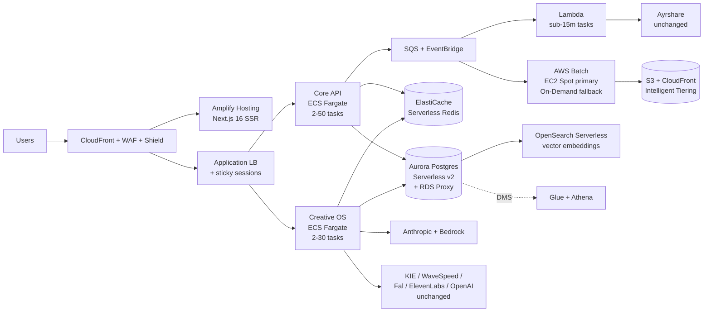

# AWS Migration — Target Architecture (One-Page Summary)

> **Status:** Provisional. Reference design prepared for the AWS Frontier AI engagement. Final architecture and migration sequence will be confirmed jointly with AWS following the AWS Frontier team meeting and Solutions Architect review.
> **Companion document:** *Aitoma Studio — AWS Migration Architecture* (full reference design, capacity plan, cost model)

## Target reference architecture

## Current stack → AWS target (summary mapping)

| Layer | Current | AWS target | Migration phase |
|-------|---------|------------|-----------------|
| Frontend | Vercel | **Amplify Hosting** + CloudFront + WAF | Phase 3 (Q2 2027) |
| Core API / Creative OS | Railway | **ECS Fargate** + ALB (sticky SSE) | Phase 1 (Q3 2026) |
| Heavy workers (UGC, clone, render) | Modal | **AWS Batch on EC2 Spot** (with on-demand fallback) | Phase 2 (Q4 2026) |
| Short async tasks + webhooks | Modal / in-process | **AWS Lambda** | Phase 1 |
| Queue / event bus | Upstash Redis (Celery) | **SQS + EventBridge** | Phase 1 |
| Cache | (none) | **ElastiCache Serverless Redis** | Phase 1 |
| Postgres | Supabase | **Aurora Serverless v2** + RDS Proxy | Phase 2 (Q1 2027) |
| Object storage | Supabase Storage | **S3** + CloudFront + Intelligent Tiering | Phase 2 |
| Vector store (moat dataset) | (planned) | **OpenSearch Serverless** or pgvector on Aurora | Phase 2 |
| Realtime / Auth | Supabase Realtime / Auth | **Deferred** — re-evaluated in Phase 3; AppSync + Cognito are options | Phase 3 |
| Secrets / observability | Railway env / console | **Secrets Manager + KMS + CloudWatch + X-Ray + Managed Grafana + GuardDuty** | Phase 1 |
| LLMs (Anthropic, OpenAI) | Direct APIs | **Direct APIs + AWS Bedrock as additional Anthropic surface** | Phase 1 (Bedrock added, not replaced) |
| Model substrate (KIE, WaveSpeed, Fal, ElevenLabs, Ayrshare) | External SaaS | **Unchanged** — model agnosticism preserved | n/a |

## 100k concurrent users — capacity headline

The architecture has no hard ceiling below 100k concurrent users. First soft limits (Anthropic rate limits, Aurora connections, Fargate cluster task count, NAT throughput) all have known mitigations that scale to the next level. Sizing at peak:

| Resource | Sizing at 100k concurrent | Cost at peak |
|---|---|---|
| Core API + Creative OS (Fargate, auto-scaled) | 30–50 + 20–30 tasks | ~$4,500/mo |
| AWS Batch (Spot primary + On-Demand fallback) | ~30,000 vCPU peak; ~15k concurrent renders | ~$6,000/mo |
| Aurora Serverless v2 (auto-scales 16–48 ACU at peak) | + RDS Proxy + read replicas | ~$3,000–$5,000/mo |
| ElastiCache + AppSync + SQS + Lambda + EventBridge | managed services, auto-scale | ~$1,000/mo |
| S3 + CloudFront (150 TB stored, 30 TB egress post-cache) | Intelligent Tiering | ~$3,000/mo |
| Edge + observability + security (CF, WAF, GuardDuty, CloudWatch, NAT, misc) | managed | ~$1,500/mo |
| **Total at 100k concurrent peak** | | **~$19,000–$24,000/mo** |

At that scale, ~$24k/month sits against ~€2.9M/month revenue (~500k paying subscribers × €69 ARPU) — **infrastructure at 0.8% of revenue**, an institutional-grade SaaS ratio.

## Phased migration (reversible until cutover)

| Phase | Quarter | Duration | Scope | Risk |
|---|---|---|---|---|
| **Phase 1 — Compute** | Q3 2026 | 6 weeks | Containerize Core API + Creative OS to Fargate; workers to AWS Batch; Lambda for async tasks; SQS + EventBridge; observability + secrets baseline. Supabase data plane unchanged. | Low–Medium |
| **Phase 2 — Data plane** | Q1 2027 | 8 weeks | Aurora Serverless v2 staging; AWS DMS replication from Supabase; 30-day parallel-write soak; ~30-second cutover at low-traffic window; Supabase kept as 7-day read-only fallback. | Medium–High (mitigated by parallel-write soak + rollback runbook) |
| **Phase 3 — Edge + Auth** | Q2 2027 | 4 weeks | Frontend to Amplify; CloudFront DNS cutover from Vercel; Cognito vs. Supabase Auth re-evaluated based on actual cost at scale. | Low |
| **Phase 4 — Multi-region** | Y2 H2 (post-Series A) | 12 weeks | EU-West-1 + US-East-1 + AP-Southeast-1 active-active via Aurora Global Database and CloudFront edge-aware routing. Activated when revenue justifies (~$10M+ ARR). | Deferred until justified |

## What stays unchanged (and why)

The model substrate is deliberately external SaaS — Anthropic, KIE.ai, WaveSpeed, Fal, ElevenLabs, OpenAI, Ayrshare, Stripe. AWS Bedrock is added as an *additional* Anthropic surface (for VPC-private routing and consolidated billing), never as a replacement. **Model agnosticism is preserved across the migration; the moat is not coupled to the substrate.**

## Cost & credit envelope

- **Y1 base case (7k subs):** $3,000–$5,000/mo on AWS — comfortably within the $25k AWS Frontier credit envelope for the first 5–8 months.
- **Y1 upside / Y2 base (16k+ subs):** $5,000–$12,000/mo — cash-positive on €4.9M base ARR.
- **100k concurrent peak (Y3):** $19,000–$24,000/mo — 0.8% of revenue at that scale.

Cost engineering built in from Day 1: EC2 Spot on Batch (70–90% off on-demand), Aurora Serverless v2 auto-pause on staging/dev, S3 Intelligent Tiering, VPC endpoints to avoid NAT data charges, Lambda for spiky tasks vs. always-on Fargate, Compute Savings Plans in Y1 H2 once we have actual utilization data. Estimated annual savings vs. naive on-demand sizing: **~$75–100k/year by Y2**.

## AWS Frontier engagement asks (in summary)

$25k AWS service credits · 4–6 weeks Solutions Architect engagement during Phase 1 · AWS Activate Founders package · AWS Bedrock Anthropic access preserving existing Anthropic enterprise terms · co-marketing optionality post-launch · discounted Aurora reserved capacity in Y1 H2.

## Strategic upside

Beyond infrastructure consolidation, this migration **accelerates three moat-compounding roadmap items** that are materially faster on AWS than on the current stack: vector similarity for "show me ads like this" (OpenSearch Serverless / pgvector), per-customer brand-voice memory (OpenSearch + Bedrock fine-tuning surfaces), and the A/B experiment framework (EventBridge + Athena + SageMaker). It also lays the SOC 2 foundations (CloudTrail + Config + Audit Manager) during migration rather than as a separate Y3 project.

---

**Final design pending AWS Frontier review.** The phasing, sizing, and component selections above are our current best-design reference architecture. We expect adjustments — particularly around Bedrock integration depth, Aurora cutover sequencing, and the Realtime/Auth Phase 3 decision — based on the AWS Solutions Architect engagement that begins Phase 1. Full reference design with capacity math, ADR index, and risk register is in *Aitoma Studio — AWS Migration Architecture*.
