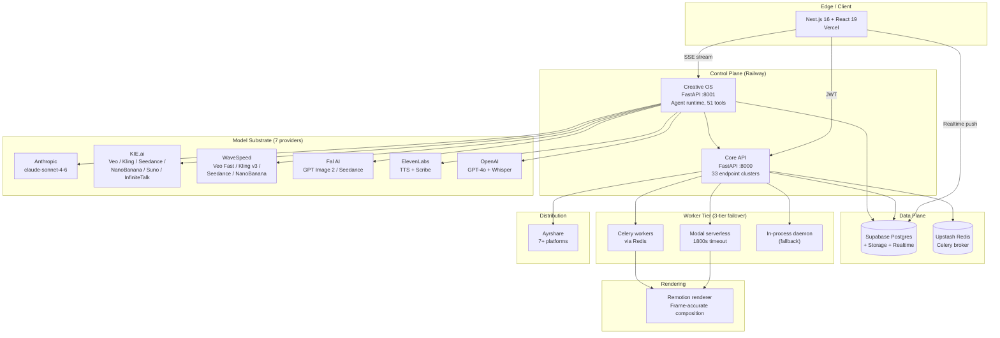
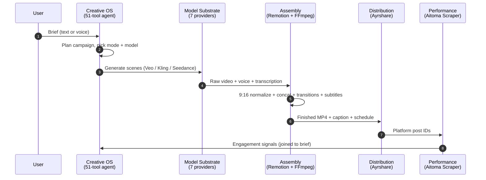
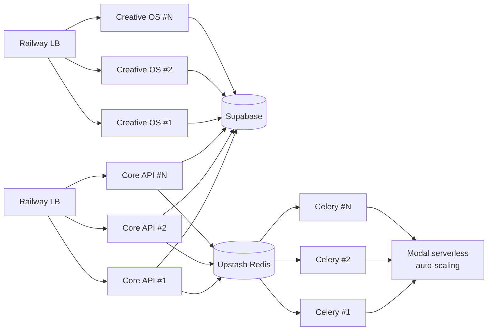

# Aitoma Studio — Technical Architecture Executive Summary
## For Partner Meeting / Investment Team Analyst Read-Ahead

> **Prepared:** May 2026 · **Audience:** Investment team analyst / data scientist · **Read time:** 15 minutes
> **Confidentiality:** STRICTLY CONFIDENTIAL · **Companion:** Full *Technical Architecture & Defensibility (CTO Defense Pack)* available on request

---

## 1. The 90-Second Read

| Question | Answer |
|----------|--------|
| **What is it?** | An autonomous AI agent that turns a natural-language brief into a finished, captioned, scheduled, performance-tracked social video — end-to-end, no human handoff |
| **Is it real?** | ~179,000 lines of production code, 816 files, 28 numbered SQL migrations, deployed across Vercel + Railway + Modal + Supabase, operating a live enterprise customer (Naiara AI: 10 personas, 30 avatars, 120 social accounts) for 3 months |
| **How is it built?** | Six-layer asynchronous pipeline with **three deployment surfaces** (FastAPI on Railway, serverless workers on Modal, Next.js on Vercel), **seven model providers** behind a uniform contract, and **a 51-tool agent runtime** on Anthropic Claude as the creative-direction layer |
| **Why is it defensible?** | Five-layer moat (agentic orchestration + model-agnostic substrate + programmable assembly + performance-attribution dataset + 4-layer switching cost). No layer is uncopyable in isolation; the combination is uncopyable on a 12-to-18-month horizon |
| **Can it scale?** | Every application service is stateless behind a managed broker (Redis) and a managed data plane (Supabase). Worker tier is serverless (Modal) with two fallback tiers. No component is a hard ceiling at Y2 base-case load (16,000 subscribers); first attention point at ~Y3 is a Supabase Supavisor upgrade — default-on for modern Supabase projects |

---

## 2. System at a Glance

### 2.1 Service topology



### 2.2 Production deploy surfaces

| Surface | Stack | Role | Where it runs |
|---------|-------|------|---------------|
| **Frontend** | Next.js 16.2, React 19.2, TypeScript 5, Tailwind 4, Remotion 4.0.4 | UI, editor, agent panel | Vercel |
| **Core API** | FastAPI, Python 3.11, Pydantic 2 | Auth, jobs, products, billing, social | Railway |
| **Creative OS** | FastAPI, async httpx, Anthropic SDK | Agent runtime, image/video gen, campaign watcher | Railway |
| **Celery worker** | Celery + Upstash Redis | Async job execution | Railway |
| **Modal worker** | Modal serverless | Burst-elastic UGC + clone + editor render | Modal Cloud |
| **Remotion renderer** | Node 20 + `@remotion/renderer` | Programmable video composition | Modal / Railway |
| **Data plane** | Supabase Postgres + Storage + Realtime | Multi-tenant DB, object storage, change feeds | Supabase Cloud |

### 2.3 Codebase scale

| Language | Files | Lines | Notes |
|----------|------:|------:|-------|
| TypeScript / TSX | 589 | 122,022 | Frontend + editor |
| Python | 181 | 48,300 | Backend + agent + pipeline |
| CSS | 5 | 6,342 | UI styling |
| SQL | 33 | 1,038 | 28 numbered migrations + schema/Stripe |
| JS / shell / other | 8 | 819 | Remotion renderer + tooling |
| **Total product code** | **816** | **~179,000** | (excl. node_modules, vendored templates, exports) |

For context: ~179k LOC is **medium-to-large SaaS scale**, the right size for a 3-engineer Pre-Seed team operating a multi-service product. Not a prototype; not enterprise-monorepo overhead.

---

## 3. The Six-Layer Pipeline

A single brief — "launch a 30-second TikTok campaign for our new lip oil" — flows through six engineered layers and returns a fully assembled, captioned, scheduled, trackable video.



### Layer-by-layer

| # | Layer | Function | Key engineering claim |
|---|-------|----------|----------------------|
| 1 | **Entry gateway** | API gateway, JWT auth, project scoping | Multi-tier worker dispatch absorbs upstream incidents (Modal → Celery → Thread) |
| 2 | **Agent (Creative OS)** | 51-tool runtime on Claude; per-project memory + cross-project memory | Cost-gated confirmation, 120s tool fingerprint dedup, hallucination regex guard, 10-second synthetic keepalive |
| 3 | **Model substrate** | 7 providers (Anthropic, KIE, WaveSpeed, Fal, ElevenLabs, OpenAI; secondary: Anthropic Messages API as agent fallback) | Pre-flight health probe (3s) + circuit breaker (10-min open) + per-provider error taxonomy |
| 4 | **Assembly** | Remotion-based programmable composition + FFmpeg | Frame-accurate, deterministic; 3-tier subtitle fallback (Remotion → ASS → no subs) |
| 5 | **Distribution** | Ayrshare for autonomous multi-platform posting | JWT-based account linking; brand credentials never touch our app |
| 6 | **Performance attribution** | Separable Aitoma Scraper service joining engagement signals back to originating brief | Loose coupling = swap data acquisition without product disruption |

---

## 4. Three Architectural Pillars

### Pillar 1 — Agentic Orchestration (Creative OS)

**51 custom tools** registered with Anthropic Managed Agents (`claude-sonnet-4-6`), grouped by capability:

| Category | # tools | Examples |
|----------|--------:|----------|
| Memory | 1 | `memory` (per-user cross-project preferences) |
| Discovery | 11 | `list_projects`, `list_products`, `get_job_status`, `get_wallet` |
| Cost | 1 | `estimate_credits` (pre-job spend preview) |
| Image / identity | 6 | `generate_image`, `generate_influencer`, `generate_product_shots` |
| Video clips | 3 | `generate_video`, `animate_image`, `extend_video` |
| Scripting | 2 | `generate_ai_script`, `generate_scripts` |
| Asset management | 8 | `create_project`, `create_product`, `analyze_product_image` |
| Full pipelines | 3 | `create_ugc_video`, `create_clone_video`, `create_bulk_campaign` |
| Campaigns | 3 | `plan_campaign`, `execute_campaign`, `get_campaign_status` |
| Social | 3 | `generate_caption`, `schedule_posts`, `cancel_scheduled_post` |
| Editor | 9 | `apply_editor_ops`, `render_edited_video`, `caption_video`, `splice_app_clip` |
| Cinematic | 1 | `create_cinematic_ad` |

**Production tuning** (three months against a live customer, since February 2026):

- 372-line in-source system prompt covering memory rules, cost gates, engine routing, anti-hallucination
- 120-second per-tool fingerprint deduplication prevents duplicate work on retry
- Confirmation gates on every cost-incurring tool; auto-fire path eliminates LLM round-trip on canonical confirm
- Regex-level hallucination detection ("firing now" without actual `tool_use` events)
- Synthetic 10s SSE keepalives during model latency; 15s keepalives during long tool execution

### Pillar 2 — Model-Agnostic Substrate

**7 providers** behind a **uniform internal contract** (`submit() → poll() → result()`):

| Provider | Modality | Models | Sync/Async | Failover |
|----------|---------|--------|-----------|----------|
| **Anthropic Managed Agents** | LLM agent runtime | claude-sonnet-4-6 | Async | Messages API (implemented) |
| **KIE.ai** | Video + image + voice + lipsync | Veo, Kling, Seedance, NanoBanana, Suno, InfiniteTalk | Async | WaveSpeed |
| **WaveSpeed** | Video + image | Veo Fast, Kling v3, Seedance, NanoBanana | Sync (via to_thread) | KIE |
| **Fal AI** | Image + video | GPT Image 2 (storyboard), Seedance ref-to-video | Async | None (errors surfaced) |
| **ElevenLabs** | TTS + transcription | v3 voice, Scribe | Sync/Async | Whisper |
| **OpenAI** | LLM + transcription | GPT-4o, GPT-4o-mini, GPT-4.1, Whisper | Sync | n/a (commodity) |

**Routing logic** (`generate_scenes.py:251-536`):

| Parameter | Value | Behavior |
|-----------|------:|----------|
| Pre-flight probe timeout | 3.0s | Lightweight health check before each call |
| Cache TTL | 60s | Probe results cached briefly to avoid hot-path cost |
| Success-rate window | 600s | Rolling generation outcomes per provider |
| Circuit-breaker rule | <50% success | Routes to alternative provider for next 10 minutes |

This is the operational mechanism behind the model-agnosticism claim: the *product mode* (UGC, cinematic, clone, product showcase) is decoupled from *which model serves it*. A customer who selects UGC doesn't know whether Veo, Seedance, or a future model produced the result. The mapping is a business decision we control.

### Pillar 3 — Programmable Assembly (Remotion)

**Not opaque stitching.** Every transition, caption, brand overlay, and CTA is engineered as a Remotion React component — frame-accurate, deterministic, parameterizable.

| Component | Scale |
|-----------|------:|
| Production NLE editor on Remotion | 487 files, ~94k LOC |
| Remotion render service | Node 20 + `@remotion/renderer`, deployed on Modal or Railway |
| Subtitle pipeline | 3-tier fallback: Remotion `render_captions.js` → FFmpeg `ass=` filter → ship without subs |
| Caption styling | Word-level Whisper transcripts → Hormozi/Mr Beast style overlay |

This is the structural reason **editor-quality post-generation refinement** is on our roadmap (Q4 2026) and is not feasible for competitors using "AI clip cutter" approaches (Submagic, OpusClip) whose entire product surface is built around opaque assembly.

---

## 5. Scalability Profile

This is the section the data scientist will care about most. Concrete ceilings, concrete numbers, concrete next-actions.

### 5.1 Component-by-component ceiling

| Component | Today's ceiling | Next bottleneck | When it bites |
|-----------|----------------|-----------------|----------------|
| **Frontend (Vercel)** | Effectively unlimited at SaaS scale | n/a | n/a |
| **Core API (Railway)** | ~1k req/s single replica | Horizontal replica + Railway Pro | Y2 (16k subs) |
| **Creative OS (Railway)** | Concurrent SSE limited by Anthropic rate limits | Anthropic enterprise tier + multi-replica COS | Y1 H2 |
| **Celery workers** | Upstash Redis ~10k commands/s; worker count is multiplicative | Sharded queues + larger broker | Y2 |
| **Modal workers** | Pay-per-invocation, effectively unlimited concurrent | Cost (not capacity) | n/a |
| **Supabase Postgres** | Standard tier ~250 concurrent conns via Supavisor (default on) | Larger compute add-on | Y2 base case |
| **Supabase Storage** | Unlimited at SaaS scale | Storage cost only | n/a |
| **Supabase Realtime** | Per-tenant connection cap on standard tier | Tier upgrade | Y2 |
| **Remotion renderer** | Modal-backed; horizontally scales | Cost only | n/a |
| **Ayrshare** | Per-account API rate limits | Multi-workspace or Meta/TikTok partner APIs (Q2 2027) | Y2 |

**At Y1 base-case load** (7,000 subscribers, ~700 active daily users at 1.5 sessions × 143 credits = ~250k credit-operations/day): every component is well under threshold.

**First actual attention point** at Y2 base case: Postgres connection pooling — and it's solved by enabling Supavisor session-mode, which is **default-on for modern Supabase projects**. This is a dashboard toggle, not an engineering project.

### 5.2 Stateless design

Every application service is **stateless**. State lives in three places only:

1. **Supabase Postgres** — canonical SaaS + agent state
2. **Supabase Storage** — assets (mp4, jpg, png, mp3)
3. **Upstash Redis** — Celery broker + result backend (ephemeral)

Two minor exceptions, both with documented persistence paths:

- `_editor_renders` dict in `editor_api.py` tracks in-flight editor render progress. Modal callback rehydrates on replica restart. Postgres persistence is a 1-day Q3 2026 task.
- Per-project `asyncio.Lock` for agent concurrency lives in single COS process. Redis-backed lock for multi-replica COS is a Q4 2026 task.

Neither prevents horizontal scaling for the next 12 months.

### 5.3 Horizontal scaling story



Today: single-replica per service. Horizontal replication is a Railway dashboard flip plus an env-var sanity check. The two in-process pieces noted above are the only blockers, both with timed roadmap items ahead of when load demands them.

### 5.4 Cost-quality optimizer (Q3 2026 productization)

We have already built the substrate (provider routing, cost config, credit pricing, success-rate measurement). The Q3 2026 work converts these from static maps into a **runtime cost-quality optimizer** that picks the cheapest provider meeting the quality bar for each generation, weighted by customer tier.

Strategic outcome: gross margin protected against **±30% provider price moves** plus a **tier-based quality differentiation** lever for upsell.

Estimated effort: **8 to 12 weeks at 2 FTE**. The building blocks are shipped.

---

## 6. Resilience & Auto-Balancing

What "auto-balanced" means here, precisely — four concrete mechanisms, every one implemented.

### 6.1 Three-tier worker dispatch

```
Job created
    │
    ▼
┌──────────────────────────────────┐
│ Tier 1: Modal (serverless, fast) │ ← USE_MODAL_WORKER=true + webhook URL
└──────────────────────────────────┘
    │ fails → 5xx, timeout, exception
    ▼
┌──────────────────────────────────┐
│ Tier 2: Celery (via Upstash)     │ ← Redis socket reachable in 1s
└──────────────────────────────────┘
    │ fails → broker unreachable
    ▼
┌──────────────────────────────────┐
│ Tier 3: In-process daemon thread │ ← Always available
└──────────────────────────────────┘
```

**Practical implication:** if Modal has an incident, jobs go to Celery. If Upstash has an incident, jobs run in the API process itself. Customers see longer queues, never 5xx errors.

### 6.2 Provider routing & circuit breaker

Pre-flight 3-second health probe runs in **parallel threads** on each provider before submitting any video generation. Cached 60s. Circuit-breaker opens for 10 minutes if a provider drops below 50% success in a 10-minute rolling window.

### 6.3 Failure-mode summary

| Failure | Mechanism | Customer-visible outcome |
|---------|-----------|--------------------------|
| Modal incident | Tier 1 → Tier 2 | None |
| Redis incident | Tier 2 → Tier 3 | Slower throughput, no 5xx |
| Single-job preemption | Stale-recovery + Celery retry | Job completes |
| Foundation-model provider outage | ProviderRouter routes to alternative | None |
| Provider degradation (slow but up) | Sticky 10-min routing to healthy provider | Better latency |
| Per-scene generation failure | 3-retry exponential backoff | None |
| Extend-chain mid-failure | Graceful truncation | Slightly shorter video |
| Subtitle Remotion failure | Cascade to FFmpeg ASS | None |
| Subtitle total failure | Ship without subtitles | Job still succeeds |
| Anthropic transient error | AgentClientRouter failover (implemented) | None |
| User submits duplicate | Per-project asyncio lock | 409-style rejection |
| Tool fires twice | 120s fingerprint dedup | Idempotent; cached result |
| User clicks Confirm twice | 10-min stash | Idempotent; single job |
| Agent hallucinates "firing now" | Regex hallucination guard | Detected + corrected |
| ElevenLabs quota | Error taxonomy maps 402 | Specific reason surfaced + credit refund |

### 6.4 State machines

Every long-running operation has an explicit status taxonomy:

| Entity | States |
|--------|--------|
| `video_jobs` | pending → processing → generating → success \| failed |
| `clone_video_jobs` | pending → processing → success \| failed |
| `product_shots` | processing → image_completed \| failed |
| `async_image_jobs` | dispatched → running → success \| failed \| cancelled |
| `campaign_plan_items` | pending → generating → ready_to_post → scheduled → posted (early exits: failed, cancelled) |

Stale rows are auto-detected (e.g. `processing >5min`) and resumed rather than producing duplicates. This is the operational difference between a system that ships demos and a system that operates against a real customer.

---

## 7. Defensibility — The 5-Layer Moat

| # | Layer | What it is | Replicability |
|---|-------|------------|---------------|
| 1 | **Agentic orchestration** | 51-tool agent runtime + cross-session memory + 3 months of production prompt tuning against Naiara (since February 2026) | A new entrant with focused engineers reaches *feature parity* in 12+ months. They cannot match *operational tuning* — the specific gates, regex guards, prompt patterns, and memory layout learned by running against a live customer |
| 2 | **Model-agnostic substrate** | 7 providers under uniform contract + health-aware routing + per-provider error taxonomy | Integrating one provider = a few weeks. Integrating seven with circuit-breaker routing = multi-quarter investment. A new entrant matches integration depth in 12-18 months; by then our routing has 12-18 months more tuning and the runtime cost-quality optimizer (Q3 2026) is shipped |
| 3 | **Programmable assembly** | 487-file Remotion-based NLE; server-render parity with client preview | Open-source library, bespoke editor on top. Competitors who built on opaque assembly cannot match post-generation refinement |
| 4 | **Performance-attribution dataset** | Joined record of brief → agent decisions → generation params → assembled output → distribution → engagement | Per-customer brand-voice depth operative from generation #1; cross-customer pattern signal becomes category-level moat at ~1,000 paying customers (Q1 2027 base case) |
| 5 | **4-layer switching cost** | Data + infrastructure + workflow + distribution layers, each compounding with usage | Starter tier has weak switching cost (low embedded usage); Business/Enterprise tier has all 4 layers active. This is the structural basis for the NRR 110%+ target |

### The structural argument

Each individual layer is crossable by some well-resourced competitor. **No single competitor is structurally free to cross all five simultaneously.** CapCut cannot prioritize cross-platform distribution (parent conflict). Canva cannot move from templated self-service to full delegation. Adobe will not move downmarket. Foundation model labs cannot integrate competing models in their own product. A $5-15M Series A-backed new entrant could attempt the full stack but starts behind on the dataset and the operated GTM playbook.

This is the defensibility framing detailed in *Market & Competition* §5.

---

## 8. Security & Multi-Tenancy

| Layer | Mechanism |
|-------|-----------|
| **Authentication** | Supabase Auth (JWT); FastAPI `Depends(get_current_user)` on every protected route |
| **Authorization** | `user_id` + `project_id` scoped queries via `*_scoped` helpers; explicit ownership checks on every read/write |
| **Row-level security** | Partial RLS — enabled on every table accessed under user JWT (agent state, campaigns, async jobs, social, products); service-role isolation on remaining tables enforced at application layer |
| **Secrets** | API keys server-side only (Railway env); Supabase anon key public-by-design; service key never exposed |
| **In transit** | TLS everywhere (Vercel, Railway, Supabase, Modal — all default-TLS) |
| **At rest** | Supabase-managed encryption |
| **OAuth (social)** | JWT-mediated via Ayrshare; brand credentials never touch our application |
| **Stripe** | Webhook signature verification; idempotency on event ID |

**What we don't have today** (honest disclosure):

- SOC 2 — Q3 2027 alongside enterprise self-serve push
- Multi-region failover — Q2 2027 with EN-language expansion (single-region today: Railway US, Supabase US default)
- GDPR DPA template — H2 2026 alongside paid SaaS launch (technically compliant on Supabase EU + Vercel EU regions; no signed template yet)
- Dedicated SRE — bundled with infrastructure eng role through Y1; dedicated function in Q1 2027

---

## 9. Engineering Team & 12-Month Roadmap

### 9.1 Headcount plan (from *Financials* §3.4.1)

| Function (FTE) | Q3 26 | Q4 26 | Q1 27 | Q2 27 | Q3 27 |
|---|--:|--:|--:|--:|--:|
| Founders (technical-contributing) | 2 | 2 | 2 | 2 | 2 |
| Senior full-stack / AI eng | 2 | 2 | 2 | 3 | 3 |
| Infrastructure eng | 1 | 1 | 1 | 1 | 1 |
| Frontend eng | 1 | 1 | 1 | 2 | 2 |
| Product manager | 0 | 0 | 0 | 1 | 1 |
| Designer | 0 | 0 | 0 | 0 | 1 |
| Contractor (surge) | 0 | 0.5 | 0.5 | 0 | 0 |
| **Engineering total** | **6** | **6.5** | **6.5** | **9** | **10** |

### 9.2 Roadmap

| Quarter | Initiative | Strategic outcome |
|---------|-----------|-------------------|
| **Q3 2026** | Production launch to waitlist; performance-attribution loop end-to-end | Each generation conditioned on labelled population history |
| **Q3 2026** | Runtime cost-quality optimizer | Gross margin protected against ±30% provider price moves |
| **Q4 2026** | Creative-similarity discovery ("show me ads like this") | Customer-visible feature powered by moat dataset |
| **Q4 2026** | Native A/B framework with auto-winner promotion | Direct ROI narrative; deepens labelled dataset |
| **Q1 2027** | Per-customer brand voice + style memory | Personalization lock-in; switching cost; expansion lever |
| **Q1 2027** | Long-form (60-90s) cinematic mode + static-image campaign mode | Doubles per-customer use cases |
| **Q2 2027** | Native integrations (Meta Ads Library, TikTok Ads Manager, Shopify) | Closes loop to revenue, not just engagement |
| **Q2 2027** | Foundation-model expansion (Sora 2 GA, evaluate Pika 2.0, position for Veo 4 / Kling 4 / Seedance 3) | Maintains optionality |
| **Q3 2027** | Self-serve enterprise (SSO, audit logs, brand safety, RBAC) | Unlocks mid-market and enterprise ACVs |

### 9.3 Architectural debt that's already scheduled

| Item | Why it exists today | When it's resolved |
|------|-------------------|-------------------|
| `ugc_backend/main.py` is 3,309 lines | Monolithic but well-organized; faster iteration | Q3 2026: split into routers (~3 days work) |
| `AgentClientRouter` not yet wired to prod route | Implemented + tested; deferred until production load justifies failover | One-line change; gated behind env flag; next deploy |
| In-process async image poller | Tracer-bullet implementation; survives single-replica | Q4 2026: move to Celery for multi-replica safety |
| Editor render state in-memory | Sub-10-min renders; restart re-hydrates via callback | Q3 2026: Postgres persistence |
| Per-project agent lock in-memory | Single COS replica today | Q4 2026: Redis-backed lock |
| Service key bypasses RLS on uploads | Intentional for RLS-blocked operations | Q4 2026: move to RPC with `SECURITY DEFINER` |

None of these is a defect. Each is a deliberate trade-off between current velocity and future hardening, with a known cost (1-day to 2-week tasks) and a scheduled date.

---

## 10. Five Numbers to Remember

For the partner meeting, these are the five quantitative anchors that capture the architecture:

| Number | What it means |
|-------:|--------------|
| **~179,000 LOC** | Production code across 816 files; medium-to-large SaaS, not a prototype |
| **51 tools** | Custom agent tools registered with Anthropic, covering memory, generation, editing, campaigns, distribution |
| **7 providers** | Model substrate breadth; uniform internal contract; circuit-breaker routing |
| **3 tiers** | Worker dispatch (Modal → Celery → Thread); no single infra incident can produce customer-visible outage |
| **28 migrations** | SQL versioning maturity; schema has evolved deliberately around the live customer workflow |

---

## 11. Bottom Line for the Analyst

| Investor concern | Engineering answer |
|------------------|-------------------|
| **"Is this a thin wrapper over Claude?"** | No. Claude is one of seven providers. We use four LLM surfaces (Claude, GPT-4o, GPT-4o-mini, GPT-4.1) and Whisper for transcription. The agent is decoupled from the model substrate, the assembly engine, the distribution layer, and the data plane. Removing Claude would require us to rewrite our agent runtime; removing any single other layer would be a much larger rewrite |
| **"Can it scale to your Y1 plan?"** | Yes. Every component is well below ceiling at Y1 base case (7k subs). First attention point at Y2 base case (16k subs) is Supabase Supavisor pooling — a dashboard toggle, not engineering work |
| **"What if Anthropic doubles their price?"** | Three mitigations in order: (1) Messages API fallback implemented; (2) agent cost is €0.96-€8.67/sub/mo, a 100% price shock compresses Creator-tier net margin from 71% to ~66%, still institutional-grade; (3) four LLM labs are actively competing, making a permanent doubling implausible |
| **"What if KIE.ai disappears?"** | WaveSpeed serves every video model we need at slightly higher cost. `USE_WAVESPEED_PRIMARY=true` flips routing in one deployment. Already production-tested |
| **"What's actually working today vs roadmap?"** | Working: all six pipeline layers, 51 agent tools, 7 providers, 3-tier worker dispatch, 28 schema migrations, partial RLS, two live enterprise customers, 1,800+ waitlist. Roadmap: cost-quality optimizer, retrieval-augmented prompts, creative-similarity discovery, A/B framework, enterprise SSO, per-customer brand-voice memory |
| **"How is the moat operating today?"** | Two of four layers durable today (model substrate, founder operating credibility). Two compounding through the next 12-18 months (data flywheel, GTM team scale). The compounding layers are not future assets — they are working mechanisms whose magnitude grows over time |

---

## 12. Appendix — One-Page Service Glossary

| Term | Meaning |
|------|---------|
| **Creative OS** | Our proprietary agentic orchestration service. Runs on Railway, port 8001. Hosts the 51-tool managed agent + image/video generation routers + campaign watcher |
| **Core API** | The SaaS REST API. Runs on Railway, port 8000. Handles auth, jobs, products, influencers, scripts, billing, social. Mounted with `clones_router` and `editor_router` |
| **Modal worker** | Serverless functions on Modal that run the heavy video pipelines. CPU-bound today (will add GPU when economics justify) |
| **Celery worker** | Standard async task queue running on Upstash Redis. Handles background work that doesn't need Modal-level scaling |
| **Remotion renderer** | Standalone Node service for frame-accurate, programmable video composition. Powers both subtitle burn-in and editor exports |
| **Aitoma Scraper** | Separate service (separate repo) for performance attribution. Architecturally decoupled to resist platform scraping countermeasures |
| **`agent_threads`** | Postgres table holding per-(user, project) conversation state including Anthropic session IDs |
| **`agent_memories`** | Postgres table holding per-user cross-project preference memory |
| **`video_jobs`** | Canonical job-tracking table; every UGC video flows through this status taxonomy |
| **`async_image_jobs`** | New table for fire-and-return async-agent images; backed by Supabase Realtime push notifications |
| **`ProviderRouter`** | The pre-flight-probing circuit-breaker routing layer between our agent and KIE/WaveSpeed/Fal |
| **`_dispatch_worker`** | The three-tier failover function that decides whether a job runs on Modal, Celery, or in-process |

---

**Document classification:** Strictly Confidential
**Companion document:** *Aitoma Studio — Technical Architecture & Defensibility (CTO Defense Pack)* — full 30+ page version with file:line citations, available for the deep-DD meeting
**Demo:** Available without NDA on request
