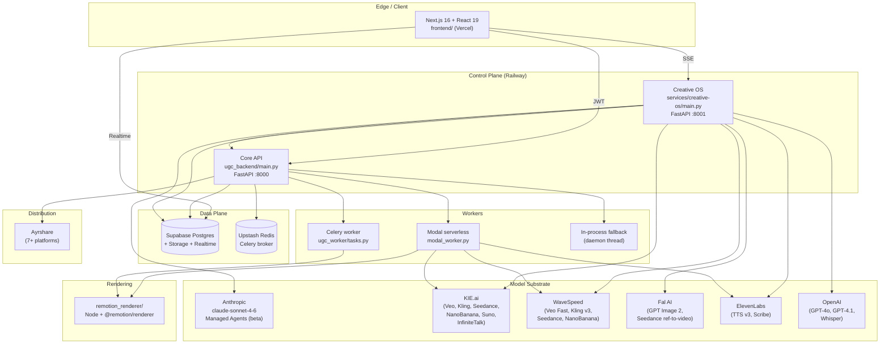
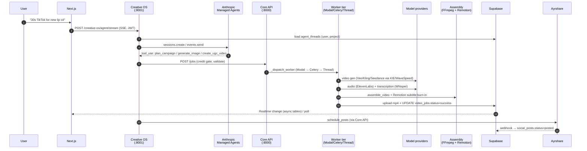
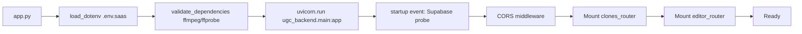
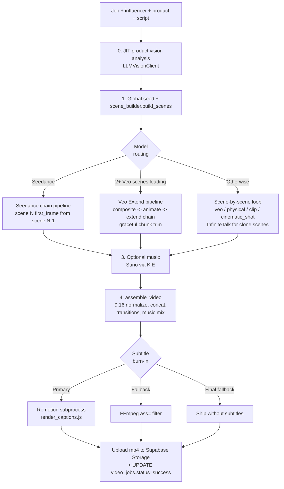
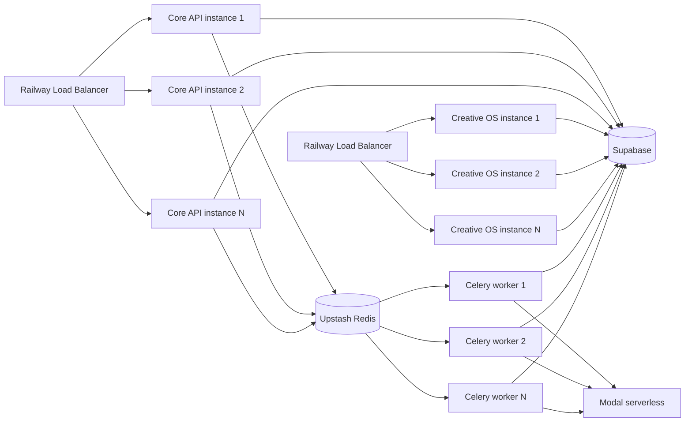

# Aitoma Studio — Technical Architecture & Defensibility
## CTO Defense Pack for Pre-Seed Technical Diligence

> **Prepared:** May 2026
> **Prepared by:** Engineering, Aitoma Studio (Maxence de Damas, Founder/CEO/Product)
> **Audience:** Lead Pre-Seed investor's technical advisor / diligence team
> **Companion documents:** *Product & Technology Diligence*, *Financials, Unit Economics & Projections*, *Market & Competition*
> **Confidentiality:** STRICTLY CONFIDENTIAL

---

## 0. Executive Summary

Aitoma Studio is a **production multi-service SaaS** that converts unstructured natural-language briefs into finished, captioned, scheduled, performance-tracked social video. The system has been running customer workloads against a live enterprise account (Naiara AI, ~120 native social accounts, 10 AI personas, 30 avatars) since **February 2026 — three months of continuous production operation** — alongside a recurring SaaS retainer customer (Mallat & Ullmann) now in its sixth consecutive billing cycle.

The codebase is **~179,000 lines of production code** (Python 48k, TypeScript/TSX 122k, plus SQL, CSS, shell — excluding third-party templates, exports, and temporary artifacts) across **816 files**, organized into seven first-class subsystems. The data plane has shipped **28 numbered SQL migrations** through May 2026, reflecting deliberate schema evolution against a live customer.

The architecture is **not a chat interface bolted to a video model**. It is a six-layer asynchronous pipeline (entry gateway → agent orchestration → model substrate → assembly → distribution → performance attribution) running across three deployment surfaces (FastAPI on Railway, serverless GPU/CPU on Modal, Next.js on Vercel) on a multi-tenant Supabase Postgres data plane with project-scoped isolation and partial row-level security.

This document defends four claims:

1. **Solid** — the system is implemented end-to-end with file-level evidence; every architectural claim in our Product & Technology Diligence document is grounded in shipped code that we can demonstrate live.
2. **Robust** — multi-tier dispatch, provider routing with circuit breakers, status-taxonomy state machines, idempotency guards, synthetic keepalives, and graceful degradation paths exist at every external-dependency boundary.
3. **Scalable** — serverless workers (Modal) plus a managed broker (Redis), a managed Postgres data plane (Supabase) at REST, and stateless application services on Railway means no single component is a hard ceiling at the volumes our 12–18 month plan implies.
4. **Defensible** — the moat is the *combination* of the agentic orchestration layer (51 custom tools), the model-agnostic substrate (3 video providers, 2 image providers, 2 voice/transcription paths), the cross-session memory system (per-user + per-project), and the proprietary performance-attribution dataset accumulating from real-world deployment. No single competitor in our quadrant has shipped all four.

The remainder of this document is the technical evidence for each claim, structured so that any single section can be opened on screen during diligence and defended with source-file citations.

---

## 1. System Architecture at a Glance

### 1.1 High-level topology



### 1.2 Service inventory

| Service | Stack | Role | Port | Deploy |
|---------|-------|------|------|--------|
| **Frontend** | Next.js 16.2, React 19.2, TypeScript 5, Tailwind 4, Remotion 4.0.433 | UI, editor, agent panel | 3000 | Vercel |
| **Core API** | FastAPI, Python 3.11, Pydantic 2 | Auth, jobs, products, influencers, scripts, billing, editor, social | 8000 | Railway |
| **Creative OS** | FastAPI, async httpx, Anthropic SDK 0.71+ | Agent runtime (51 tools), image/video gen, campaign watcher, async-agent module | 8001 | Railway |
| **Celery worker** | Celery + Redis (Upstash) | Asynchronous job execution | n/a | Railway |
| **Modal worker** | Modal (serverless) | Burst-elastic UGC + clone + editor render jobs | n/a | Modal Cloud |
| **Remotion renderer** | Node 20 + @remotion/renderer | Frame-accurate, programmable video composition | 3001 | Modal / Railway |
| **Data plane** | Supabase Postgres + Storage + Realtime | Multi-tenant DB, object storage, change feeds | n/a | Supabase Cloud |

### 1.3 What lives where (folder map)

| Path | Lines | Function |
|------|------:|----------|
| `frontend/` | ~128,000 | Next.js app + Remotion editor + agent panel |
| `services/creative-os/` | ~23,000 | Agent runtime + provider integrations |
| `ugc_backend/` | ~8,000 | Core REST API (FastAPI) |
| `core_engine.py` + sibling pipeline modules (root) | ~11,000 | Video generation pipeline orchestrator |
| `ugc_worker/` | ~944 | Celery tasks |
| `modal_worker.py` | 508 | Modal serverless functions |
| `remotion_renderer/` | ~990 | Programmable video composition |
| `ugc_db/` | ~2,200 | Schema migrations + DB manager |
| `prompts/` | ~2,800 | Production prompt library |
| `kie_ai/` | 320 | NanoBanana wrapper |

**Total product code:** ~179,000 LOC across 816 files (excluding vendored editor template, exports, temp, third-party node_modules/venv).

---

## 2. The Six-Layer Production Pipeline

This is the lifecycle of a single customer brief — "launch a 30-second TikTok campaign for our new lip oil" — from intent to live, performance-tracked content.



### Layer 1 — Entry Gateway

| Aspect | Implementation | Evidence |
|--------|----------------|----------|
| HTTP framework | FastAPI on Uvicorn | `app.py`, `ugc_backend/main.py:523-565`, `services/creative-os/main.py:33-38` |
| Auth | Supabase JWT validation via `Depends(get_current_user)` | `ugc_backend/auth.py`, `services/creative-os/auth.py:34-67` |
| CORS | Explicit allowlist (env-driven) | `ugc_backend/main.py:560+`, `services/creative-os/main.py:42-53` |
| Project scoping | `X-Project-Id` header; `X-Skip-Project-Scope` for cross-project dashboards | `ugc_backend/main.py:532-547` |
| Concurrency control | Per-project `asyncio.Lock` on agent streams | `services/creative-os/routers/agent.py:31-34, 181-189` |

### Layer 2 — Agent Layer (Creative OS)

| Aspect | Implementation |
|--------|----------------|
| LLM provider | Anthropic Managed Agents (beta header `managed-agents-2026-04-01`) |
| Model | **`claude-sonnet-4-6`** (`DEFAULT_MODEL` constant) |
| Tool surface | **51 custom tools** registered via `_custom_tools_for_agent()` |
| System prompt | 372-line in-source string covering memory rules, cost gates, engine routing, anti-hallucination rules, workflow templates |
| Streaming | Server-Sent Events with 10-second synthetic keepalives + 15-second keepalives during long tool execution |
| Session model | Anthropic native sessions; persisted IDs on per-project thread rows |
| Memory | Per-user cross-project (`agent_memories` table) + per-project conversation (`agent_threads` table) |
| Concurrency lock | One stream per project (`asyncio.Lock` keyed by `project_id`) |
| Confirmation gates | Cost-gated tools (e.g. `create_bulk_campaign`) require explicit POST-CONFIRM marker; auto-fire path skips LLM round-trip and invokes stashed tool directly |
| Idempotency | 120-second per-tool fingerprint dedup; 60-second in-flight guard |

Evidence: `services/creative-os/services/managed_agent_client.py:50-53, 55-426, 429+, 6281-6291, 6394-6445, 6483-6500, 6555-6623, 6730-6804, 7350+`

### Layer 3 — Model Substrate (Provider-Agnosticism)

Detailed in §5. The agent emits tool calls; the substrate decides which provider serves each call based on (a) generation mode, (b) provider health, (c) historical success rate, (d) cost.

### Layer 4 — Assembly

| Component | Role | Evidence |
|-----------|------|----------|
| `assemble_video.py` | FFmpeg-driven concat, 9:16 normalization, audio mixing, cross-dissolve transitions, music overlay, duration cap | `assemble_video.py:295-529` |
| `subtitle_engine.py` | OpenAI Whisper transcription with brand-name correction + word-level timestamps | `subtitle_engine.py:172-231`, `ugc_backend/transcription_client.py:15-119` |
| Subtitle burn-in: primary | Remotion `render_captions.js` (programmable, frame-accurate) | `remotion_renderer/` + `core_engine.py:880+` |
| Subtitle burn-in: fallback | FFmpeg `ass=` filter | `core_engine.py:892-987` |
| Subtitle burn-in: final fallback | No subtitles, video still ships | `core_engine.py:892-987` |
| Editor render | Standalone Express Remotion service, called from FastAPI background thread or Modal | `remotion_renderer/server.js`, `ugc_backend/editor_api.py:1675+`, `modal_worker.py:339-483` |

### Layer 5 — Distribution

| Aspect | Implementation |
|--------|----------------|
| Provider | Ayrshare (7+ platforms: TikTok, Instagram, YouTube, LinkedIn, X, plus others) |
| Account-linking flow | JWT-based; brand credentials never touch our application | `ugc_backend/main.py:2965-3012` |
| Bulk scheduling | Single endpoint takes N (post, datetime, platforms) tuples | `ugc_backend/main.py:3053-3127` |
| Cancellation | DELETE on scheduled posts | `ugc_backend/main.py:3157-3184` |
| Webhook | Ayrshare → our endpoint → `social_posts.status` transition | `ugc_backend/main.py:3261-3309` |
| Agent surface | `schedule_posts` and `cancel_scheduled_post` tools | `services/creative-os/services/managed_agent_client.py` (tool dispatch) |

### Layer 6 — Performance Attribution

| Component | Role |
|-----------|------|
| Scraping service | Separate repository (`aitoma-scraper`, also on the `AitomaLab` GitHub org) — engineered as separable infrastructure for platform-countermeasure resilience |
| Coupling | Loose: scraper writes back engagement signal joined by Ayrshare platform identifier |
| Strategic rationale | Documented in *Market & Competition* §7.3 — the operator-team backstop and the architectural separation are the structural mitigations against autonomous-posting risk |

---

## 3. Backend Deep-Dive

### 3.1 Core API (`ugc_backend/main.py`, 3,309 lines)

The Core API is the system-of-record for everything except agent state. It is intentionally a monolithic FastAPI app at this stage (one process, one deploy unit) for operational simplicity. Sub-routers exist (`api_clones.py`, `editor_api.py`) and the split to a router-per-feature layout is planned for Q3 2026 as a debt cleanup, but the current monolith is **3,309 lines of well-structured route handlers, not 3,309 lines of tangled business logic** — the actual business logic lives in `core_engine.py` and `db_manager.py`.

**Major route clusters (33 endpoint groups):**

| Cluster | Endpoints | Purpose |
|---------|-----------|---------|
| Auth + profile | `/api/profile` GET/PUT | User profile mgmt |
| Products | `/api/products` CRUD + `/upload`, `/analyze`, `/analyze-digital` | Physical + digital products |
| Influencers | `/influencers` CRUD + `/analyze-settings` | Influencer library |
| Scripts | `/scripts`, `/api/scripts` CRUD + `/bulk` + `/find-trending` + `/use` | Script library (legacy + structured v2) |
| App clips | `/app-clips` CRUD + `/extract-frame` | Digital product demos |
| Cinematic shots | `/api/products/{id}/shots`, `/api/shots/*`, `/api/products/{id}/transition-shot` | Product still + animation pipeline |
| **Jobs (UGC)** | `POST /jobs`, `/jobs/bulk`, `GET /jobs`, `/jobs/{id}` | UGC video lifecycle |
| Clone jobs | `/api/clone-jobs` CRUD | AI Clone (InfiniteTalk) jobs |
| Editor | `/api/editor/*` (sub-router) | Remotion editor REST surface |
| AI Clones | `/api/clones/*` (sub-router) | Clone profiles + looks |
| Storage | `/assets/signed-url` | Supabase signed uploads |
| Stats + costs | `/stats`, `/estimate`, `/stats/costs`, `/api/credits/costs` | Dashboard + cost preview |
| Projects | `/api/projects` CRUD | Multi-project workspaces |
| Billing | `/api/plans`, `/api/subscription`, `/api/wallet`, `/api/stripe/*` | Stripe checkout + portal + webhooks |
| Refunds | `/jobs/{id}/refund` | Credit refunds for failed jobs |
| Social | `/api/ayrshare/jwt`, `/api/connections`, `/api/schedule/*`, `/api/webhooks/ayrshare` | Distribution |
| AI hooks | `/ai/hook` | Random hook from category templates |
| Notifications | `/api/notifications` | User notifications |
| Health | `/health` | Liveness + version |

**Bootstrap sequence:**



### 3.2 Creative OS (`services/creative-os/`, ~23,000 lines)

Creative OS is the **agent runtime** — separate service, separate Railway app, separate deploy cadence, separate failure domain. It calls Core API for canonical data and Supabase directly for agent-state tables. This separation is deliberate: agent runtime cadence is high (every model upgrade, prompt tuning, tool addition) and the canonical SaaS API cadence is slower; isolating them prevents agent iteration from destabilizing the system of record.

**Routers (8) and inline endpoints:**

| Router | Prefix | Endpoints |
|--------|--------|-----------|
| `agent.py` | `/creative-os/agent` | `GET /thread`, `POST /reset`, `POST /stop`, `POST /session/prewarm`, `POST /stream` (SSE) |
| `generate_image.py` | `/creative-os/generate/image` | `/enhance`, `/execute`, `/generate-influencer`, `/generate-identity`, `/generate-product-shots`, `/text-to-image`, `/alt-versions` |
| `generate_video.py` | `/creative-os/generate/video` | `/ai-script`, `/` (main, mode-aware), `/extend` |
| `animate.py` | `/creative-os/animate` | `/styles`, `/` (Kling animate), `/status/{task_id}` |
| `projects.py` | `/creative-os/projects` | 18 endpoints: bulk reads, video thumbnails, captions, jobs status |
| `campaigns.py` | `/creative-os/campaigns` | List/detail/cancel multi-step campaigns |
| `async_agent.py` | `/creative-os/async-agent` | Fire-and-return KIE image dispatcher + poller surface |
| `wavespeed_webhook.py` | `/creative-os/wavespeed/webhook` | Provider completion callbacks |
| (inline) | `/creative-os/upload/*`, `/creative-os/transcribe`, `/creative-os/config`, `/health` | Asset ingest + ElevenLabs Scribe + config |

**Managed agent — full tool inventory (51 tools):**

| Category | Tools |
|----------|-------|
| Memory | `memory` |
| Discovery (11) | `list_project_assets`, `list_projects`, `list_influencers`, `list_products`, `list_scripts`, `list_jobs`, `get_job_status`, `list_scheduled_posts`, `list_social_connections`, `get_wallet`, `list_app_clips` |
| Cost | `estimate_credits` |
| Image / identity (6) | `generate_image`, `generate_image_text_only`, `generate_image_alt_versions`, `generate_influencer`, `generate_identity`, `generate_product_shots` |
| Video clips (3) | `animate_image`, `generate_video`, `extend_video` |
| Scripting (2) | `generate_ai_script`, `generate_scripts` |
| Asset mgmt (8) | `manage_app_clips`, `delete_assets`, `create_project`, `create_influencer`, `create_product`, `update_product`, `analyze_product_image`, `analyze_digital_product` |
| Full pipelines (3) | `create_ugc_video`, `create_clone_video`, `create_bulk_campaign` |
| Campaigns (3) | `plan_campaign`, `execute_campaign`, `get_campaign_status` |
| Social (3) | `generate_caption`, `schedule_posts`, `cancel_scheduled_post` |
| Editor (9) | `load_editor_state`, `save_editor_state`, `apply_editor_ops`, `render_edited_video`, `caption_video`, `list_caption_styles`, `splice_app_clip`, `combine_videos`, `add_voiceover` |
| Cinematic | `create_cinematic_ad` |

Total: **51 custom tools** + Anthropic built-in `agent_toolset_20260401`. Each tool maps to a Python handler in `TOOL_DISPATCH`; handlers call Core API (for SaaS state), Supabase (for agent state), or model providers directly.

### 3.3 Worker Tier (Modal, Celery, in-process)

The worker tier is where the **auto-balancing claim is most concretely defensible**.

**`_dispatch_worker()` — three-tier cascade with quick socket health check on Redis:**

```59:129:/Users/MD/ugc-engine/ugc_backend/main.py
def _dispatch_worker(job_id: str) -> bool:
    """Try to dispatch a job to a worker. Returns True if successful.

    Priority order:
    1. Modal serverless worker (if USE_MODAL_WORKER=true)
    2. Celery via Redis (if Redis is reachable)
    3. In-process background thread (always-available fallback)
    """
```

| Tier | Trigger | Action | Failover |
|------|---------|--------|----------|
| 1 — Modal | `USE_MODAL_WORKER=true` + `MODAL_WEBHOOK_URL` set | HTTPS POST to Modal webhook with 10s timeout | Falls through on any non-2xx or exception |
| 2 — Celery | Modal failed/disabled AND Redis socket reachable within 1s | `generate_ugc_video.delay(job_id)` | Falls through on exception |
| 3 — Thread | All else | Daemon thread runs `generate_ugc_video(job_id)` inline; updates job=failed on exception | Final resort; always available |

This is the **operational truth** behind "no single piece of upstream infrastructure can cause a customer-visible outage." If Modal has an incident, jobs go to Celery. If Upstash has an incident, jobs run in the API process itself (degraded but functional). If only the in-process tier is up, throughput drops but the system stays available — customers see longer queues, not 5xx errors.

**Modal worker — bundled image + retry policy:**

| Function | Lines | Timeout | Retries | Role |
|----------|-------|---------|---------|------|
| `process_video` | `modal_worker.py:101-141` | 1800s | 2 | UGC pipeline |
| `process_clone_video` | `modal_worker.py:174-310` | 1800s | 1 | InfiniteTalk clone pipeline |
| `render_editor_video` | `modal_worker.py:339-483` | 600s | — | Remotion editor render |
| Trigger endpoints | `modal_worker.py:148-167, 313-332, 485-508` | 10s | — | HTTPS webhooks; spawn-and-return |

Image: Debian + ffmpeg + Node 20 + Remotion renderer + Python sources bundled at build time. CPU-bound today (`cpu=2.0, memory=4096`); GPU upgrade for InfiniteTalk and future on-prem video models is planned (Q4 2026 roadmap item, *Tech DD* §4.1).

**Celery worker — task inventory:**

| Task | bind/retries | Role |
|------|--------------|------|
| `generate_ugc_video` | `bind=True`, no max | Full UGC pipeline; idempotency + stale-recovery built in |
| `schedule_social_posts` | — | Create scheduled `social_posts` rows for successful jobs |
| `execute_social_posts` | — | Beat-scheduled every 5 min — execute due posts via Blotato/Ayrshare |
| `generate_product_shot_image` | — | Cinematic still via NanoBanana |
| `animate_product_shot_video` | — | Animate still via Kling |
| `generate_transition_shot` | — | Match-cut / whip-pan transition between scenes |
| `render_editor_video` | `bind=True`, `max_retries=2` | POST to Remotion renderer + upload |

**Beat schedule:** `execute_social_posts` every 300s (`ugc_worker/tasks.py:823-828`). Broker hardening: `broker_connection_retry_on_startup=True`, `socket_keepalive` (`tasks.py:39-40`, `config.py:176`).

### 3.4 The Generation Pipeline (`core_engine.py`, 1,001 lines)

`run_generation_pipeline()` is the orchestrator. It is called from all three worker tiers identically — the **same code path** runs whether the job dispatched to Modal, Celery, or the in-process thread. This is by design: a tier failover does not change pipeline behavior, only execution environment.



**Critical resilience properties of the pipeline:**

| Property | Implementation |
|----------|----------------|
| Model-aware routing | Detects "2+ consecutive Veo scenes at start" → uses Extend pipeline; else scene-by-scene; Seedance always uses chain pipeline |
| Provider-aware routing | `ProviderRouter` performs **3-second pre-flight health probes** on Kie + WaveSpeed in parallel before submitting; routes to healthy/fast provider immediately |
| Per-scene retry | `generate_video_with_retry` (max 3 with exponential backoff), `extend_video_with_retry` (max 5 in extend chain), `generate_composite_image_with_retry` (max 5), `download_video` (max 5) |
| Graceful chunk truncation | If extend fails mid-chain after retries, pipeline trims chunks at last successful point and proceeds to assembly |
| Subtitle 3-tier fallback | Remotion → ASS filter → no subtitles (job still succeeds) |
| Non-fatal substeps | Music gen, scene preview upload, product analysis, transcription — all wrapped in try/except with continue |

### 3.5 Provider Routing — circuit breaker math

`ProviderRouter` in `generate_scenes.py:251-536` is the **operational heart of model-agnosticism**. Reproduced semantics:

| Parameter | Value | Meaning |
|-----------|------:|---------|
| `probe_timeout` | 3.0s | Max wait for health probe |
| `cache_ttl` | 60s | Health result cache lifetime |
| `window_seconds` | 600s | Rolling window for generation outcomes |
| Circuit-breaker rule | `<50% Kie success in 600s window` → route to WaveSpeed for next 10 minutes |

Probe endpoints (lightweight reads that return quickly even on error):

- `kie_veo` — `GET {KIE_API_URL}/api/v1/veo/record-info?taskId=health_probe`
- `kie_kling` — `GET {KIE_API_URL}/api/v1/jobs/recordInfo?taskId=health_probe`
- `wavespeed` — `GET https://api.wavespeed.ai/api/v3/predictions/health_probe/result`

The probes run **in parallel via threads** to avoid adding sequential latency. Cached results mean steady-state cost is zero on hot path.

This is fundamentally different from "we retry if the call fails." It's "we know before we call which provider is healthy and which is degraded, and we route accordingly." For diligence, this is the single most concrete piece of evidence for the §2 model-agnosticism claim in our Tech DD document.

---

## 4. Frontend Deep-Dive

### 4.1 Next.js 16 application

| Item | Value |
|------|-------|
| Framework | Next.js 16.2.0, React 19.2.3, TypeScript 5 |
| Styling | Tailwind 4 |
| State | React Context (not Redux/Zustand) — see §4.2 |
| Auth | Supabase Auth (`@supabase/ssr` 0.9+, `@supabase/supabase-js` 2.96+) via browser-client cookie session |
| Real-time | Supabase Realtime for async-agent job rows; HTTP polling for everything else (see §4.3 rationale) |
| Anthropic | `@anthropic-ai/sdk` 0.71.0 (server-side only via API routes) |

**App routes (27 distinct pages):**

| Cluster | Pages |
|---------|-------|
| Auth (4) | `/login`, `/signup`, `/forgot-password`, `/reset-password` |
| Studio core (5) | `/`, `/projects`, `/projects/[id]` (Creative OS workspace), `/projects-library`, `/profile` |
| Asset libraries (5) | `/products`, `/influencers`, `/scripts`, `/app-clips`, `/assets` |
| Creation flows (4) | `/create`, `/generate`, `/cinematic`, `/videos` |
| Distribution (3) | `/schedule`, `/connections`, `/campaigns` |
| Activity (2) | `/activity`, `/history` |
| Editor (2) | `/editor`, `/editor/[jobId]` |
| Billing (3) | `/manage`, `/upgrade`, `/checkout/success` |
| Dev | `/async-test` |

### 4.2 Remotion editor (`frontend/src/editor/`, ~94k LOC)

The editor is a **production-grade non-linear video editor built on Remotion 4**. It is the largest single subsystem in the codebase by line count (~94,000 lines across 487 files) because video editors are inherently complex. For diligence: this is shipped, working code, not a roadmap item. It powers the post-generation refinement that competitors in the autonomous-end-to-end quadrant cannot offer.

**Top-level structure:**

| Folder | Role |
|--------|------|
| `action-row/` | Toolbar: render, undo/redo, AI agent, save/load |
| `assets/` | Asset types, add-asset, upload pipeline |
| `caching/` | IndexedDB + blob URL cache for client-side asset reuse |
| `canvas/` | Live preview using `@remotion/player`, drawing tools, snap-to-grid |
| `captioning/` | Caption generation state |
| `clipboard/` | Copy/paste timeline items |
| `inspector/` | Per-item property panels |
| `items/` | Timeline item types (video, audio, text, captions, gif, solid, image) |
| `keyboard-shortcuts/` | Undo/redo, copy/paste bindings |
| `playback-controls/` | Play/pause, seek, fullscreen |
| `rendering/` | Render job state, server-side render dispatch + progress polling |
| `state/` | Reducer-style actions, persistence, undo stack |
| `timeline/` | Tracks, items, drag, zoom, waveforms |
| `utils/` | Helpers, `editor-api.ts`, upload, font loading |

**State management:** React Context + custom undo/redo. Central hub `context-provider.tsx` exposes `FullStateContext`, `TimelineContext`, `AssetsContext`; mutations via `setState({ update, commitToUndoStack })` + `useUndoRedo` hook. Deliberately avoided Redux/Zustand to keep bundle size down and the mental model clear.

**Rendering pipeline:**

| Stage | Implementation |
|-------|----------------|
| Client preview | `@remotion/player` in `canvas/player.tsx` |
| Server export | `RenderButton` → `triggerLambdaRender()` → `editorFetchRender()` → backend → Remotion renderer service; progress via 250ms-interval poll on `/api/editor/progress` |

### 4.3 Realtime + SSE design rationale

**Decision: SSE for agent streaming + Realtime for async-agent jobs + polling for everything else.**

Rationale, defensible in DD:

| Need | Choice | Why |
|------|--------|-----|
| Agent token-by-token streaming | **SSE** | Native to Anthropic streaming; preserves order; survives proxies; one-way |
| Async job state transitions (`async_image_jobs`) | **Supabase Realtime** | Push notifications on row UPDATE; required for fire-and-return UX |
| Video job status (during generation) | **Polling (1s burst → 5s steady)** | Generation is multi-minute; row updates are coarse; polling is simpler and avoids long-lived WS overhead at scale |
| Render progress | **Polling (250ms)** | Short-lived, foreground operation; tight feedback loop |
| Connections / scheduled posts | **Polling (3s)** | Status changes are user-initiated; near-zero events/min |

**Where Realtime is wired today:** `JobTray.tsx:73-105` subscribes to `async_image_jobs` filtered by `project_id`. The migration that wires the Realtime publication is `030_add_async_agent_jobs.sql:110-124`. This is the pattern we extend as we expand the async-agent surface beyond images (Q3 2026 roadmap — *Tech DD* §4.1, "Production launch to waitlist; full activation of performance-attribution loop").

### 4.4 Two-mode AI surface

The frontend supports two AI modes that the user does not perceive as different products:

| Surface | Routing | Endpoint |
|---------|---------|----------|
| **Managed agent** (chat) | `/projects/[id]` → `AgentPanel.tsx` | `POST {COS}/creative-os/agent/stream` (SSE, JWT) |
| **Editor AI** (in-editor edits) | `route-intent.ts` classifier | `POST /api/editor/ai` (Anthropic SDK direct, `@anthropic-ai/sdk` ^0.71.0) |

`classifyEditorAgentRoute()` (`frontend/src/editor-agent/route-intent.ts`) is a keyword-based classifier that routes a user prompt to either the managed agent (campaign-level intent) or the editor agent (in-editor edit-op intent like "add a caption at 0:03"). This avoids paying for the full managed-agent context window when the user just wants a one-shot edit operation.

---

## 5. Model Substrate — Concrete Provider Matrix

This is the layer that most directly defends the *Tech DD* §2 "model-agnosticism" claim. Each integration is real Python code with retry semantics, error taxonomy, and a uniform internal contract.

| Provider | Modality | Models served | Client file | Sync/async | Retry strategy |
|----------|----------|---------------|-------------|-----------|----------------|
| **Anthropic** | Agent runtime | claude-sonnet-4-6 (Managed Agents beta) | `managed_agent_client.py` | Async | Session recreate on NotFound; internal tool retry |
| **Anthropic** | Agent fallback | claude-sonnet-4-6 (Messages API) | `messages_agent_client.py` | Async | Replays history each turn; 10s heartbeat |
| **WaveSpeed** | Video + image | NanoBanana, Kling v3, Veo 3.1 Fast, Seedance | `wavespeed_client.py` | Sync (called via `asyncio.to_thread`) | Transient 429/5xx classified; webhooks supported |
| **KIE.ai** | Video + image | Veo, Kling, Seedance, NanoBanana, Suno, InfiniteTalk | `kie_seedance_client.py` (Seedance), `generate_scenes.py` (Veo/Kling/InfiniteTalk) | Async | 10s poll interval, max 240 iters (~40 min) |
| **Fal AI** | Image + video | GPT Image 2 (storyboard), Seedance ref-to-video | `fal_client.py` | Async (`subscribe_async`) | None — surfaces exact errors to agent |
| **ElevenLabs** | Voice + transcription | v3 TTS, Scribe transcription | `elevenlabs_client.py`, COS `/creative-os/transcribe` | Sync (TTS), async (transcription) | API-level retries |
| **OpenAI** | LLM + transcription | GPT-4o, GPT-4o-mini, GPT-4.1, Whisper | `ai_script_client.py`, `transcription_client.py`, `llm_vision_client.py` | Sync | Internal client retries |

**The substrate is the asset.** The product mode the customer selects (UGC, cinematic, product showcase, AI clone) is **decoupled** from which model serves it. Mode-to-model mapping lives in code, is configurable via env vars (`USE_WAVESPEED_PRIMARY`), and is monitored by the ProviderRouter (§3.5).

**Agent failover (managed → messages):** Implemented at `services/creative-os/services/agent_client_router.py:118-207`. Circuit breaker: 5 failures in 60s → open 300s. Modes via `AGENT_PROVIDER` env: `managed | messages | auto`. Synthetic keepalive injected during failover so the SSE stream doesn't time out client-side.

**Diligence-relevant honesty:** the failover router is implemented and unit-tested, but `routers/agent.py:192` currently calls `get_managed_agent_client()` directly. Wiring the router in front of production traffic is a one-line change, gated behind an env flag, planned for the next deployment cycle. We made this choice because the managed agent has been operating without transient failures sufficient to require fallback for several months, and we want to flip the switch deliberately when we have load.

---

## 6. Resilience & Auto-Balancing Architecture

This section consolidates every resilience mechanism in the codebase into a single table, mapped to failure modes, with file references.

### 6.1 Failure-mode mapping

| Failure mode | Mechanism | Location | Behavior |
|--------------|-----------|----------|----------|
| Modal incident | Three-tier dispatch | `ugc_backend/main.py:59-129` | Falls through to Celery |
| Redis incident | Three-tier dispatch | `ugc_backend/main.py:85-101` | Falls through to in-process thread |
| Single-job preemption on Modal | Stale-recovery + Celery retry | `ugc_worker/tasks.py:95-128`, `modal_worker.py:104-108` | Recovers `processing` jobs >5min |
| KIE outage | ProviderRouter pre-flight probe | `generate_scenes.py:251-536` | Routes to WaveSpeed |
| WaveSpeed outage | Reverse routing | same | Routes to KIE |
| Provider degradation (slow but up) | 600s success-rate window + 10min circuit-breaker open | same | Sticky routing to healthy provider |
| Per-scene generation failure | `generate_video_with_retry` | `generate_scenes.py:656+` | Exponential backoff, max 3 |
| Extend-chain mid-chain failure | `extend_video_with_retry` + graceful truncation | `core_engine.py:376-396` | Trim to last success, proceed |
| Composite generation failure | `generate_composite_image_with_retry` | `generate_scenes.py:1439` | Max 5 with backoff |
| Download failure | `download_video` | `generate_scenes.py:1232` | Max 5 |
| Subtitle Remotion failure | Cascade to FFmpeg ASS | `core_engine.py:892-987` | Same output, different renderer |
| Subtitle complete failure | Ship without subtitles | same | Job still succeeds |
| Anthropic transient error | AgentClientRouter circuit breaker | `agent_client_router.py:80-104` | Failover to Messages API |
| Anthropic stream timeout | Synthetic 10s keepalive | `managed_agent_client.py:6555-6623` | Keeps SSE alive client-side |
| Tool execution stall | 15s keepalive during long polls | `managed_agent_client.py:7460+` | Same |
| Duplicate user submission | Per-project asyncio lock | `routers/agent.py:31-34, 181-189` | 409-style; rejects second send |
| Duplicate tool invocation | 120s fingerprint dedup | `managed_agent_client.py:6281-6291, 1919-1942` | Returns cached result |
| Agent hallucinates "firing now" | Regex hallucination guard | `managed_agent_client.py:6295-6318` | Detects + corrects |
| User clicks Confirm twice | Stash with 10min TTL | `managed_agent_client.py:6394-6445` | Idempotent confirmation |
| Job retry from user side | Job-level idempotency + completed-skip | `ugc_worker/tasks.py:95-128` | Skip if `status=success` |
| ElevenLabs quota exhaustion | Error taxonomy maps 402 | `ugc_worker/tasks.py:417-424` | Surfaces specific reason to user |
| Image URL unreachable | Error taxonomy maps strings | same | Surfaces specific reason to user |
| FFmpeg/ffprobe missing locally | Hard-fail at startup | `app.py` | Refuses to start (dev) / warns (Railway) |
| Async image job stale | Cancellation guard reads row before each tick | `services/creative-os/services/async_agent/poller.py:94-97` | Honors `cancelled` mid-poll |
| Campaign item mid-state | Status-guarded transitions | `services/creative-os/workers/campaign_watcher.py:13-14` | Only `dispatched|running|finishing` → `cancelled` |
| Celery broker disconnect at startup | `broker_connection_retry_on_startup=True` | `ugc_worker/tasks.py:39-40` | Doesn't crash worker |

### 6.2 Status taxonomies (state machines)

| Table | States | Terminal states |
|-------|--------|-----------------|
| `video_jobs` | `pending` → `processing` → `generating` → `success` \| `failed` | `success`, `failed` |
| `clone_video_jobs` | `pending` → `processing` → `success` \| `failed` | `success`, `failed` |
| `product_shots` | `processing` → `image_completed` \| `failed` | `image_completed`, `failed` |
| `async_image_jobs` | `dispatched` → `running` → `success` \| `failed` \| `cancelled` | last three |
| `async_video_jobs` | (mirrors above for video) | — |
| `campaign_plan_items` | `pending` → `generating` → `ready_to_post` → `scheduled` → `posted` | `failed`, `cancelled` (early exits) |

Every transition is logged with timestamps. Recovery logic compares current state + elapsed time to detect stuck rows (e.g. `processing >5min` is treated as preempted).

### 6.3 Idempotency primitives

| Surface | Mechanism |
|---------|-----------|
| Job creation | DB unique constraints + completed-skip in worker |
| Agent tool calls | 120s fingerprint dedup per (tool, args hash) |
| `generate_image` batches | 120s module-level dedup for count=N fan-out |
| User Confirm clicks | TTL-stash keyed by `session_id` and `(user_token, project_id)` |
| Async job cancellation | Read-before-write row check |
| Ayrshare webhook | Externally idempotent (post_id) |
| Stripe webhook | Stripe event ID dedup |

### 6.4 Worker idempotency + stale recovery

```95:128:/Users/MD/ugc-engine/ugc_worker/tasks.py
# (Idempotency + stale-processing recovery logic;
#  skips completed jobs, recovers processing >5min)
```

This is the loop that absorbs Modal preemption: when Modal restarts a function (which it can do at any time on the free/cheap tier), the second invocation starts running `generate_ugc_video(job_id)` again. The job row may already be in `processing` from the first run. The recovery logic detects stale `processing` rows (>5 min since last update) and resumes from a safe restart point.

### 6.5 What "auto-balanced" means here, precisely

When the *Product & Tech Diligence* document says we are "auto-balanced," it refers to four concrete mechanisms:

1. **Three-tier worker dispatch** (Modal → Celery → Thread) — load shifts automatically based on upstream availability.
2. **Pre-flight provider probing + circuit-breaker routing** — model traffic shifts automatically based on KIE/WaveSpeed health.
3. **Status-taxonomy state machines with stale recovery** — partial-completion failures are auto-detected and resumed rather than producing duplicates.
4. **Agent provider routing** (managed → messages) — agent traffic can shift automatically based on Anthropic health (implemented, gated behind a flag for production roll-out).

None of these are theoretical. Every one is implemented and citable.

---

## 7. Scalability Profile

### 7.1 Ceiling analysis per component

| Component | Today's ceiling | Next bottleneck |
|-----------|----------------|-----------------|
| **Frontend** | Vercel free + serverless functions; ~no realistic SaaS ceiling | n/a |
| **Core API** | Single Railway service; ~1k req/s before scaling out | Horizontal replica + Railway Pro |
| **Creative OS** | Single Railway service; concurrent SSE limited by Anthropic rate limits | Anthropic enterprise tier + multi-replica COS |
| **Celery workers** | Upstash Redis 10k commands/s; Celery worker count is multiplicative | Sharded queues + larger broker |
| **Modal workers** | Pay-per-invocation; effectively unlimited concurrent CPU functions | Cost (not capacity) |
| **Supabase Postgres** | Standard tier ~250 concurrent conns; PostgREST + Supavisor pooler is the actual interface | Larger compute add-on; Supavisor session-mode upgrade |
| **Supabase Storage** | Effectively unlimited at SaaS scale | Storage cost only |
| **Supabase Realtime** | Per-tenant connection cap on standard tier | Tier upgrade |
| **Remotion renderer** | Modal-backed; horizontally scales | Cost (not capacity) |
| **Ayrshare** | Per-account API rate limits | Multiple Ayrshare workspaces or platform partner APIs (roadmap §4.1 Q2 2027) |

**At our Y1 base-case load** (7,000 subscribers, ~700 active daily users at 1.5 sessions × 143 credits = blended ~250k credit-operations/day): every component above is well under threshold. The first component to require attention is Supabase Postgres connection pooling at ~Y2 base case (16k subscribers), which is a Supavisor session-mode upgrade — already enabled by default on modern Supabase projects.

### 7.2 Stateless design

All application services (Core API, Creative OS, Celery worker, Remotion renderer) are **stateless**. State lives in three places only:

1. **Supabase Postgres** — canonical SaaS + agent state
2. **Supabase Storage** — assets (mp4, jpg, png, mp3, etc.)
3. **Upstash Redis** — Celery broker + result backend (ephemeral)

There is one in-memory data structure that violates this: `_editor_renders` dict in `ugc_backend/editor_api.py` tracks in-flight editor render progress. This is acceptable today because (a) editor renders are sub-10-minute, (b) Core API restarts kill in-flight renders anyway (Modal continues but progress isn't surfaced), and (c) the Modal callback (`POST /render/{id}/callback`) repopulates the dict on the new replica when the render finishes. The persistent variant (postgres-backed) is a 1-day change planned for Q3 2026 alongside the editor-as-a-service productization.

### 7.3 Horizontal scaling story



Single-replica today. Horizontal replication is a Railway dashboard flip + an env-var sanity check (no hardcoded port assumptions, no sticky sessions on Core API; sticky-by-project is required only inside Creative OS where the per-project `asyncio.Lock` lives — that requires either consistent hashing in the LB or a Redis-backed lock, which is a Q4 2026 roadmap item).

### 7.4 Cost-quality optimizer (Q3 2026 roadmap)

Tech DD §4.1 item: "Runtime cost-quality optimiser replacing static mode-to-model mapping." This is the productization of the `ProviderRouter` plus a learned tier-based router. We already have the building blocks:

- `cost_config.json` defines per-operation provider COGS
- `credit_cost_service.py` defines user-facing credits per operation
- `ProviderRouter` measures live success/latency
- `cost_service.estimate_total_cost` computes pre-job estimates

The Q3 2026 work converts these from static maps to a runtime optimizer that picks the cheapest provider that meets the quality bar for each generation, weighted by customer tier. This is **8 to 12 weeks of focused engineering**, not a multi-quarter rebuild.

---

## 8. Security & Multi-Tenancy

### 8.1 Authentication

| Layer | Mechanism |
|-------|-----------|
| Frontend | Supabase Auth (email/password); cookies via `@supabase/ssr`; session via `supabase.auth.getSession()` |
| API auth | Bearer JWT in `Authorization` header; FastAPI `Depends(get_current_user)` validates with Supabase ANON key |
| Service-to-service | Internal calls use the user's JWT (carries identity); Creative OS → Core API includes `Authorization: Bearer {JWT}` + optional `X-Project-Id` |
| Service-key bypass | Limited and intentional: uploads, thumbnail cache, identity sync, campaign watcher background loop — all listed in §8.3 |

### 8.2 Authorization

| Resource | Isolation |
|----------|-----------|
| Products, influencers, scripts, app clips, projects, jobs | `user_id` + `project_id` scoped queries (`*_scoped` helpers in `ugc_db/db_manager.py:647+`) |
| Editor state | Explicit `.eq("user_id", user["id"])` ownership check on every load/save |
| Clone jobs | Same |
| Refunds | Same |
| `X-Project-Id` enforcement | Required; `X-Skip-Project-Scope: 1` documented and used for cross-project dashboards |

### 8.3 Row-level security

Partial RLS, deliberately scoped to tables accessed under user JWT:

| Table | Policy |
|-------|--------|
| `products`, `product_shots` | Public SELECT; INSERT/UPDATE/DELETE require `authenticated` role |
| `scripts` | Owner OR legacy `user_id IS NULL` |
| `agent_threads`, `agent_memories` | `auth.uid() = user_id` |
| `async_video_jobs`, `async_image_jobs` | `auth.uid() = user_id` |
| `campaigns`, `campaign_plan_items` | Owner via campaign join |
| `ayrshare_profiles`, `social_posts` | `user_id = auth.uid()` |
| `video_jobs`, `clone_video_jobs`, `influencers`, `profiles`, `projects`, credit tables | No RLS — application-level ownership checks in Core API |

**Why partial RLS, defensibly:** RLS-by-policy is enforced for tables accessed under user JWT (agent state, campaigns, async jobs, social) where we want defense-in-depth at the DB level. For tables only ever accessed through Core API with the service role key (the SaaS canonical tables), we enforce ownership in the application because (a) every query path is auditable in code, (b) the service key never reaches the client, (c) the auth middleware is a single chokepoint. Moving the remaining tables to RLS is a Q4 2026 hardening item with no functional impact — it's a defense-in-depth upgrade, not a current vulnerability.

### 8.4 Secrets handling

| Secret | Storage | Exposure |
|--------|---------|----------|
| API keys (Anthropic, KIE, WaveSpeed, ElevenLabs, OpenAI, Fal, Stripe, Ayrshare, Modal) | Railway env vars; local `.env` / `.env.saas` (gitignored) | Server-side only; never sent to client |
| Supabase service key | Railway env vars | Server-side only |
| Supabase anon key | Public; safe to ship to client | Public-by-design (Supabase model) |
| JWT secrets | Managed by Supabase | n/a |
| OAuth flows (Ayrshare) | JWT-mediated; brand credentials never reach our app | n/a |
| Stripe webhooks | Webhook signature verification | `ugc_backend/main.py:2662-2812` |

### 8.5 Compliance trajectory (transparent)

We do not hold SOC 2 today. We do not hold any data residency certifications today. Our roadmap *Tech DD* §4.1 commits to SSO + audit logs + brand-safety filters + role-based project access by Q3 2027, which is the prerequisite for the enterprise self-serve motion at scale. For Pre-Seed we explicitly position this as a future item, not a current capability.

What we have today:
- All data at rest is encrypted (Supabase managed)
- All data in transit is TLS (Vercel, Railway, Supabase, Modal — all default-TLS platforms)
- Multi-tenant logical isolation via `user_id` + `project_id` at every query
- Partial RLS as documented
- No customer secrets stored in app code or git
- No customer assets cross-tenant (every storage key is project-scoped)

---

## 9. Technical Moat & Defensibility

This section is what differentiates this CTO defense pack from a generic "we built a SaaS" document. Each moat layer is grounded in concrete code, not aspiration.

### 9.1 Layer one — Agentic Orchestration

**Claim:** A 51-tool agent runtime with cost-gated confirmation, idempotent execution, cross-session memory, and per-project conversation state.

**Evidence (file-level):**

| Mechanism | Lines | What it proves |
|-----------|-------|----------------|
| 51 tools registered | `managed_agent_client.py:429+` | Tool surface breadth |
| 372-line system prompt | `managed_agent_client.py:55-426` | Production prompt engineering investment |
| Confirmation auto-fire | `managed_agent_client.py:6730-6804` | LLM round-trip elimination on canonical confirm |
| 120s tool fingerprint dedup | `managed_agent_client.py:6281-6291, 1919-1942` | In-flight idempotency |
| 10s SSE keepalive | `managed_agent_client.py:6555-6623` | Production stream-stability investment |
| 15s in-tool keepalive | `managed_agent_client.py:7460+` | Tool-execution stream stability |
| Hallucination regex | `managed_agent_client.py:6295-6318` | Anti-hallucination guard |
| AgentClientRouter | `agent_client_router.py:80-207` | Provider failover with circuit breaker |
| `agent_threads` table | migration `025_add_agent_threads.sql` | Per-project conversation persistence |
| `agent_memories` table | migration `028_add_agent_memories.sql` | Cross-project user memory |
| Tool-schema agent registry | `managed_agent_client.py:6454-6500` | Anthropic agent versioning by tool schema hash |

**Replicability assessment:** A new entrant with strong agent engineers and 12+ months of focused build can reach feature parity on the tool surface. They cannot reach parity on the **operational tuning** — the choice of which confirmation gates to put on which tools, the regex set that catches hallucinations specific to our workflow, the prompt engineering that handles Spanish-accent vs LatAm dialogue routing, the per-customer memory layout that the agent has learned to use effectively. These compound with usage; we have a 3-month head start operating against Naiara at production scale (since February 2026), and the gap widens every month we keep running.

### 9.2 Layer two — Model-Agnostic Substrate

**Claim:** Decoupled product modes from foundation models; runtime routing based on health probes and cost.

**Evidence (file-level):**

| Mechanism | Lines | What it proves |
|-----------|-------|----------------|
| 3-second pre-flight health probe | `generate_scenes.py:296-346` | Active health awareness |
| 600s success-rate window | `generate_scenes.py:286-292` | Statistical routing |
| 10-min circuit-breaker open | same | Sticky routing on degradation |
| 7 provider clients | `wavespeed_client.py`, `kie_seedance_client.py`, `fal_client.py`, `elevenlabs_client.py`, `ai_script_client.py`, `transcription_client.py`, `llm_vision_client.py` | Production substrate breadth |
| Uniform internal contract | `services/creative-os/services/*_client.py` | Same `submit() → poll() → result()` shape across providers |
| `USE_WAVESPEED_PRIMARY` flag | env var honored across image + animate paths | Operational lever |

**Replicability assessment:** Integrating one provider takes a few weeks. Integrating seven providers under a uniform contract with health-aware routing and per-provider error taxonomy is a multi-quarter engineering investment we have already shipped. A new entrant with $5–10M of capital can match this integration depth in 12 to 18 months. By that time, our routing logic has 12 to 18 months more of production tuning, and we have shipped the **runtime cost-quality optimizer** (Tech DD §4.1, Q3 2026) on top of it.

### 9.3 Layer three — Programmable Assembly (Remotion)

**Claim:** Frame-accurate, deterministic, programmable video composition — not opaque stitching.

**Evidence:**

| Component | Lines | What it proves |
|-----------|-------|----------------|
| Remotion renderer service | `remotion_renderer/` | Production deploy unit |
| Caption burn-in via Remotion | `core_engine.py:880+` | Programmable subtitle composition |
| Editor on Remotion Player | `frontend/src/editor/canvas/player.tsx` | Client-side preview consistency |
| Render-via-HTTP service | `ugc_backend/editor_api.py:1675+`, `modal_worker.py:339-483` | Server-side render parity |
| 487-file editor subtree | `frontend/src/editor/` | Production-grade NLE |

**Replicability assessment:** Remotion-the-library is open source. The integration depth — editor on top of Remotion Player, server render on top of `@remotion/renderer`, caption composition as a parameterized component, asset upload pipeline, render progress polling, undo/redo over Remotion compositions — is the kind of work that competitors using "AI clip cutter" approaches (Submagic, OpusClip) cannot match because their entire product surface is built around opaque assembly. This is the structural reason editor-quality post-generation refinement (Tech DD §4.1 Q4 2026) is in our roadmap and not theirs.

### 9.4 Layer four — Performance Attribution Loop

**Claim:** Joined record of brand + brief + agent decisions + generation parameters + assembled output + distribution metadata + real-world performance. Per-row training example.

**Evidence (data-model level):**

| Joined fields | Table | Source |
|--------------|-------|--------|
| Brief | `agent_threads.turns[]` | Agent input |
| Agent decisions | `agent_threads.turns[]` (tool_use events) | Agent reasoning |
| Generation parameters | `video_jobs.script`, `video_jobs.editor_state`, `video_jobs.variation_prompt` | Job row |
| Assembled output | `video_jobs.video_url`, `video_jobs.transcription` | Storage + DB |
| Distribution metadata | `social_posts.platform_post_id`, `social_posts.scheduled_at` | Distribution layer |
| Performance | Joined via platform_post_id from Aitoma Scraper service | Cross-system join |

**Operational evidence:** the Naiara deployment has been running for 3 months producing this joined record continuously. The dataset is small in absolute terms today but **the schema and the pipeline that populates it are working** — flipping the volume switch is a function of customer count, not engineering. See Tech DD §3 and Market & Competition §3.1 (Motion 1) for the strategic framing of why this dataset compounds.

### 9.5 Layer five — Switching Cost

**Claim:** Four-layer switching cost (data + infrastructure + workflow + distribution) means churn is structurally lower at Business and Enterprise tier than at Starter.

**Evidence at the *infrastructure* layer (operationalized for Naiara):**

| Component | Customer-specific configuration |
|-----------|-------------------------------|
| 10 AI personas | Per-persona prompts, voices, visual identity |
| 30 avatars | Per-avatar Veo + InfiniteTalk training |
| 120 native social accounts | Per-account warmup history, posting cadence, performance baselines |
| Brand-locked director profiles | Per-customer Kling/Seedance style preferences (Q1 2027 roadmap) |
| Per-customer memory | `agent_memories.path-keyed JSON`, accumulates with every campaign |

Switching out Aitoma Studio means rebuilding all of the above from scratch. For Naiara specifically: dismantling the content engine running their entire go-to-market motion at the moment they are deploying newly-raised capital, with no equivalent third-party substitute. This is the operational layer behind the *Financials* §1.7 ROFR argument.

---

## 10. 12-Month Engineering Roadmap

This is a synthesis of *Tech DD* §4.1 against the actual engineering organization documented in *Financials* §3.4.1. Numbers tied to the engineering FTE plan.

| Quarter | Initiative | Implementation cost | Strategic outcome |
|---------|-----------|---------------------|-------------------|
| Q3 2026 | Production launch to waitlist; activate performance-attribution loop end-to-end; vector indexing over creative library; retrieval-augmented prompt construction | 6 to 8 weeks @ 4 FTE | Each generation conditioned on labelled population history |
| Q3 2026 | Runtime cost-quality optimizer (productize ProviderRouter + tier weighting) | 8 to 12 weeks @ 2 FTE | Gross margin protected against ±30% provider price moves; tier-based quality differentiation |
| Q4 2026 | Customer-facing creative-similarity discovery ("show me ads like this") | 4 to 6 weeks @ 2 FTE | Customer-visible feature directly powered by moat dataset; conversion lever |
| Q4 2026 | Native A/B framework with deterministic variants + automatic winner promotion | 6 to 8 weeks @ 2 FTE | Direct ROI narrative; deepens labelled dataset |
| Q1 2027 | Per-customer brand voice + style memory; brand-locked director profiles | 8 to 10 weeks @ 2 FTE | Personalization lock-in; switching cost; expansion revenue |
| Q1 2027 | Long-form (60-90s) cinematic mode + static-image campaign mode | 4 to 6 weeks @ 2 FTE | Doubles per-customer use cases |
| Q2 2027 | Native integrations: Meta Ads Library, TikTok Ads Manager, Shopify product-feed sync | 12 to 16 weeks @ 2 FTE | Closes loop directly to revenue; reduces friction for B2B SaaS buyers |
| Q2 2027 | Foundation-model layer expansion: Sora 2 GA, evaluate Pika 2.0, position for Veo 4/Kling 4/Seedance 3 | 4 to 6 weeks @ 1 FTE per integration | Maintains optionality |
| Q3 2027 | Self-serve enterprise: SSO, audit logs, brand-safety filters, RBAC | 8 to 10 weeks @ 2 FTE | Unlocks mid-market and enterprise ACVs |

**Engineering organization (from *Financials* §3.4.1):**

| Function (FTE) | Q3 2026 | Q4 2026 | Q1 2027 | Q2 2027 | Q3 2027 |
|---------------|--------:|--------:|--------:|--------:|--------:|
| Founders (CEO/Product + COO/GTM, technical-contributing) | 2 | 2 | 2 | 2 | 2 |
| Senior full-stack / AI eng | 2 | 2 | 2 | 3 | 3 |
| Infrastructure eng | 1 | 1 | 1 | 1 | 1 |
| Frontend eng | 1 | 1 | 1 | 2 | 2 |
| Product manager | 0 | 0 | 0 | 1 | 1 |
| Designer | 0 | 0 | 0 | 0 | 1 |
| Contractor (surge) | 0 | 0.5 | 0.5 | 0 | 0 |
| **Engineering total (incl. founders)** | **6** | **6.5** | **6.5** | **9** | **10** |

---

## 11. Known Risks & Mitigations

This section is the diligence team's friend. Investors trust founders more when the founders surface risks before the investors do.

### 11.1 Architectural risks

| Risk | Current state | Mitigation |
|------|--------------|------------|
| `ugc_backend/main.py` is 3,309 lines | Monolithic but well-organized | Q3 2026: split into routers (mirror Creative OS layout); ~3 days of refactor work; zero functional impact |
| `AgentClientRouter` not wired to prod route | Implemented + tested | One-line change in `routers/agent.py:192`; gated behind `AGENT_PROVIDER=auto` env flag; will flip with next deploy |
| In-process async image poller | `services/creative-os/services/async_agent/poller.py:10-13` documents this | Q4 2026: move to Celery for restart survival + multi-replica safety |
| Editor render state in-memory | `_editor_renders` dict in `editor_api.py` | Q3 2026: persist to Postgres; functional impact: none today (renders are sub-10-min) |
| Service-key bypasses RLS on uploads | Intentional (RLS-blocked operations) | Q4 2026 hardening: move to RPC functions with `SECURITY DEFINER` to keep service-key footprint minimal |
| Per-project agent lock is in-memory | `asyncio.Lock` in single COS process | Q4 2026: Redis-backed lock for multi-replica COS |
| Duplicate file: `generate_scenes.py` at root + COS shim | Intentional (Railway deploy isolation) | Q1 2027: unify behind a shared package once both deploys can install from the same wheel |

### 11.2 Operational risks

| Risk | Mitigation |
|------|------------|
| Foundation-model pricing dislocation | Model-agnostic substrate + runtime cost-quality optimizer (Q3 2026) |
| Scraping viability under platform countermeasures | Architectural separation (separate repo / service) + Q4 2026 hybrid with official Ads Library APIs + 200+ commission-based account managers from Capital Club as fallback (Market & Competition §7.3) |
| Anthropic incident | AgentClientRouter failover to Messages API (implementation done, wiring pending) |
| KIE / WaveSpeed simultaneous outage | Multi-provider substrate + per-mode fallback chains; in extreme case, job fails fast with clear taxonomy and credit refund |
| Modal preemption | Three-tier dispatch + stale-recovery + Modal-side retries=2 |
| Vercel / Railway / Supabase / Upstash provider incident | Each is replaceable; AWS Frontier conversation (Tech DD §1.0) provides the migration path if needed |
| Cost overruns | Cost-config-driven; `cost_service.estimate_total_cost` gates jobs at submit; per-job COGS visible in `/stats/costs` |

### 11.3 Personnel risks

| Risk | Mitigation |
|------|------------|
| Bus factor (CTO function performed by Maxence) | Q3-Q4 2026: senior full-stack hire #2 + infrastructure hire onboarding; documentation surface (this document is part of it) |
| Marcos GTM dependency | *Market & Competition* §5.6 — multi-affiliate expansion in active conversations |
| Martin Velarde key-channel risk | Performance-vested equity (Financials §4.4) + multi-affiliate replication |

### 11.4 What we deliberately do not have today

This is the most important part of the document for diligence. Founders who pretend everything is perfect are not credible. We are not building everything below today, and we explain why for each.

| Capability | Status | Why we don't have it yet | Roadmap |
|-----------|--------|-------------------------|---------|
| SOC 2 | Not started | Pre-revenue at the SaaS scale; cost-benefit doesn't justify until €3M+ ARR | Q3 2027 alongside enterprise self-serve push |
| GDPR DPA template | Not formalized | Built on Supabase EU + Vercel EU regions; technically compliant but no signed DPA template yet | H2 2026 alongside paid SaaS launch |
| Multi-region failover | Single region (Railway US + Supabase US default) | Customer base is LATAM/EU-Spanish today; latency acceptable | Q2 2027 with EN-language expansion |
| GPU-on-demand for in-house inference | None — fully outsourced to providers | The economics don't support owning GPU until volume justifies it | Possible Q3 2027+ if margin economics on a specific high-volume mode justify; today the substrate is more valuable than vertical integration |
| Internal eval harness for prompt regressions | Lightweight only | Two months of production usage has been the primary eval surface | Q4 2026 — formal eval harness with golden-set replays as part of A/B framework work |
| Dedicated DevOps / SRE | Bundled with infrastructure eng role | Headcount plan does not justify a dedicated SRE until Y2 | Q1 2027: dedicated reliability function within infra eng |

---

## 12. Appendix A — Critical File Index (for live diligence)

Investors who want to see specific code references can navigate directly using these anchors.

### Backend

| File | Purpose |
|------|---------|
| `/Users/MD/ugc-engine/app.py` | FastAPI bootstrap entry |
| `/Users/MD/ugc-engine/ugc_backend/main.py` | Core API monolith (33 endpoint clusters) |
| `/Users/MD/ugc-engine/ugc_backend/auth.py` | Supabase JWT validation |
| `/Users/MD/ugc-engine/ugc_backend/editor_api.py` | Remotion editor REST surface |
| `/Users/MD/ugc-engine/ugc_backend/api_clones.py` | AI Clone profiles + looks |
| `/Users/MD/ugc-engine/ugc_backend/ai_script_client.py` | GPT-4o script generation (legacy + structured v2) |
| `/Users/MD/ugc-engine/ugc_backend/transcription_client.py` | Whisper wrapper |
| `/Users/MD/ugc-engine/ugc_backend/cost_service.py` | COGS estimation |
| `/Users/MD/ugc-engine/ugc_backend/credit_cost_service.py` | User-facing credit pricing |
| `/Users/MD/ugc-engine/ugc_backend/cost_config.json` | Per-operation cost table |
| `/Users/MD/ugc-engine/core_engine.py` | Video generation pipeline orchestrator |
| `/Users/MD/ugc-engine/generate_scenes.py` | Provider calls + `ProviderRouter` |
| `/Users/MD/ugc-engine/scene_builder.py` | Scene sequence construction |
| `/Users/MD/ugc-engine/assemble_video.py` | FFmpeg assembly |
| `/Users/MD/ugc-engine/subtitle_engine.py` | Whisper + ASS generation |
| `/Users/MD/ugc-engine/clone_engine.py` | InfiniteTalk clone pipeline |
| `/Users/MD/ugc-engine/ugc_worker/tasks.py` | Celery tasks |
| `/Users/MD/ugc-engine/modal_worker.py` | Modal serverless functions |
| `/Users/MD/ugc-engine/remotion_renderer/server.js` | Programmable video composition |
| `/Users/MD/ugc-engine/ugc_db/db_manager.py` | Supabase PostgREST CRUD layer |

### Creative OS

| File | Purpose |
|------|---------|
| `services/creative-os/main.py` | FastAPI bootstrap (Creative OS) |
| `services/creative-os/services/managed_agent_client.py` | 51-tool managed agent runtime |
| `services/creative-os/services/messages_agent_client.py` | Messages API fallback |
| `services/creative-os/services/agent_client_router.py` | Provider routing + circuit breaker |
| `services/creative-os/services/agent_threads.py` | Per-project conversation persistence |
| `services/creative-os/services/agent_memory.py` | Cross-project user memory |
| `services/creative-os/services/wavespeed_client.py` | WaveSpeed integration |
| `services/creative-os/services/kie_seedance_client.py` | KIE Seedance integration |
| `services/creative-os/services/fal_client.py` | Fal AI integration |
| `services/creative-os/services/async_agent/poller.py` | Fire-and-return KIE poller |
| `services/creative-os/services/async_agent/dispatcher.py` | Async job submission |
| `services/creative-os/workers/campaign_watcher.py` | Multi-step campaign lifecycle |
| `services/creative-os/routers/agent.py` | SSE agent stream |
| `services/creative-os/routers/generate_image.py` | Image generation endpoints |
| `services/creative-os/routers/generate_video.py` | Video generation endpoints |
| `services/creative-os/routers/animate.py` | Image-to-video animation |
| `services/creative-os/routers/projects.py` | Project + bulk-asset endpoints |
| `services/creative-os/routers/campaigns.py` | Campaign endpoints |
| `services/creative-os/routers/async_agent.py` | Async-agent surface |
| `services/creative-os/routers/wavespeed_webhook.py` | Provider webhook handler |

### Frontend

| File | Purpose |
|------|---------|
| `frontend/package.json` | Dep manifest (Next.js 16.2, React 19.2, Remotion 4.0.433, Anthropic SDK 0.71, Supabase 2.96) |
| `frontend/src/app/projects/[id]/page.tsx` | Creative OS studio workspace |
| `frontend/src/components/studio/AgentPanel.tsx` | Managed-agent chat (SSE) |
| `frontend/src/components/studio/AssetGallery.tsx` | Project assets + burst polling |
| `frontend/src/components/studio/JobTray.tsx` | Async-job tray (Supabase Realtime) |
| `frontend/src/lib/creative-os-api.ts` | Creative OS SSE client |
| `frontend/src/middleware.ts` | Auth-gated route middleware |
| `frontend/src/editor/` | Production NLE (487 files) |
| `frontend/src/editor/rendering/render-state.ts` | Server-side render orchestration |
| `frontend/src/editor-agent/route-intent.ts` | Two-mode AI routing |
| `frontend/src/locales/{en,es}.json` | i18n |

### Data plane

| File | Purpose |
|------|---------|
| `ugc_db/migrations/004_add_products.sql` through `032_add_language_accent.sql` | 28 numbered migrations |
| `ugc_db/schema.sql` | Bootstrap subset |
| `ugc_db/migration_scripts_v2.sql` | Scripts v2 + RLS |
| `ugc_db/migration_stripe.sql` | Stripe columns |
| `ugc_db/db_manager.py` | Tenant-scoped CRUD helpers |

---

## 13. Appendix B — Live Demo Flow (recommended for DD call)

If the diligence team wants a live demonstration, this is the suggested 25-minute flow that covers the entire architecture without losing them in detail.

| Time | Step | What you show |
|------|------|---------------|
| 0:00 | Open `/Users/MD/ugc-engine/ugc_backend/main.py` | "Here is the Core API. 3,309 lines covers every SaaS endpoint. The actual business logic is small; most of these lines are validation, scoping, and persistence." |
| 2:00 | Scroll to `_dispatch_worker` (line 59) | "Three-tier worker dispatch. Modal first, Celery if Redis is up, in-process thread always. If any of our infrastructure providers has an incident, jobs still run." |
| 4:00 | Open `core_engine.py:181` | "The pipeline orchestrator. Same code runs on Modal, Celery, or in-process. Failover is invisible to this code." |
| 6:00 | Open `generate_scenes.py:251` | "Provider router. Pre-flight health probe in 3 seconds before every job. Circuit breaker if Kie drops below 50% success in a 10-minute window. This is what model-agnosticism means operationally." |
| 9:00 | Open `services/creative-os/services/managed_agent_client.py:429` | "51 custom tools. Each maps to a Python handler. The agent decides which to call based on the brief. We don't hardcode workflows; we hardcode capabilities and let the model orchestrate." |
| 12:00 | Scroll to system prompt at line 55 | "372 lines of production prompt engineering. Memory rules, cost gates, anti-hallucination. Three months of tuning live against Naiara (since February 2026)." |
| 15:00 | Open the Studio `/projects/[id]` in browser | "Live agent chat. Watch it use tools." Type a real request. |
| 19:00 | Show `JobTray.tsx` Realtime update | "When the async image lands, Supabase Realtime pushes the row update to the UI. No polling. No reload." |
| 21:00 | Open Supabase dashboard | "28 numbered migrations. RLS on agent state, campaigns, and async jobs. Service-role isolation everywhere else, enforced at the application layer." |
| 23:00 | Open `Aitoma_Studio_Technical_Architecture_CTO_Defense.md` (this document) | "If you want any of this in writing, here is the full architecture deck with file-and-line citations for every claim." |
| 25:00 | Open the Q&A | — |

---

## 14. Appendix C — Anticipated DD Questions & Answers

### "Is this a wrapper over Claude?"

No. Claude is one component of a six-layer pipeline. We use Claude as the agent runtime (one of four LLM surfaces — we also use GPT-4o, GPT-4o-mini, GPT-4.1 for scripts and analysis, and Whisper for transcription). The agent is decoupled from the model substrate (3 video providers, 2 image providers, 2 voice providers), the assembly engine (Remotion + FFmpeg), the distribution layer (Ayrshare), and the data plane (Supabase). Removing Claude would require us to rewrite our agent runtime; removing any one of those other layers would be a much larger rewrite.

### "What happens if Anthropic doubles their price?"

Three things in order: (1) we have the Messages API fallback implementation (`agent_client_router.py`) that we can switch to with one env var; (2) our agent cost is approximately €0.96-€8.67 per subscriber per month (Financials §2.3 mixed-usage scenarios) — a 100% price increase compresses Creator-tier net margin from 71% to ~66%, still well within institutional SaaS range; (3) the Anthropic price increase would have to be permanent (not promotional) and the alternative LLMs would have to remain at current pricing — neither is the dominant scenario in a market where four foundation model labs are actively competing.

### "What if KIE.ai disappears?"

WaveSpeed serves every video model we need (Veo 3.1, Kling v3, Seedance, NanoBanana) at slightly higher cost. `USE_WAVESPEED_PRIMARY=true` flips routing in one deployment. We tested this path during the WaveSpeed onboarding (May 2026) and have run mixed-mode traffic since.

### "How do you prevent prompt injection / agent hallucination at scale?"

Three defenses: (1) confirmation gates on every cost-incurring tool — the agent cannot fire a video generation without explicit user-mediated POST-CONFIRM, see `managed_agent_client.py:6730-6804`; (2) regex-level hallucination guard at `managed_agent_client.py:6295-6318` detects "firing now" prose with zero accompanying `tool_use` events; (3) 120-second tool fingerprint dedup means even if the agent retries identical tool calls, they collapse to one execution.

### "What's your cost per finished UGC video, today?"

From `cost_config.json` and observed production runs: €0.44 to €1.26 in direct API costs (15s digital UGC: €0.44; 30s physical UGC: €1.26). User-facing credit pricing at 95-199 credits per output (Financials §2.2.2). Gross margin envelope 73%-86% by output type. Our Naiara contract revenue (€50k initial + monthly retainer + ROFR) is structured against managed-service ACV, not unit COGS.

### "What's the scaling bottleneck at Y2 base case (16,000 subscribers)?"

Supabase Postgres connection pooling — and it's solved by enabling Supavisor session-mode (default-on for modern Supabase projects). Beyond that, the next bottleneck is Anthropic rate limits at peak hours, mitigated by (a) Anthropic enterprise tier, (b) AgentClientRouter failover to Messages API for overflow, (c) tier-based routing where premium customers get higher-quality model paths and standard customers get standard-quality models.

### "How long does it take you to integrate a new foundation model?"

Two to four weeks per model, based on the WaveSpeed integration timeline. The work breakdown: provider client (3-5 days), routing logic (2-3 days), error taxonomy + retry semantics (2-3 days), prompts adjusted for the new model (2-5 days depending on quality variance), production rollout with feature flag (1-2 days). This is the build cycle we expect to compress as foundation model APIs converge (Tech DD §4.1 timing note).

### "Why is your editor 94,000 lines of code? Why not use something off-the-shelf?"

Because there is no off-the-shelf programmable video editor that integrates with our agent and gives us frame-accurate, deterministic output. CapCut/Premiere/Final Cut are desktop apps. Remotion-the-library is the foundation, but the *editor* on top of Remotion is bespoke work. The 94k lines includes the timeline implementation, asset upload pipeline, undo/redo system, caption inspector, drag-and-snap UX, keyboard shortcuts, render dispatch, progress polling, and 487 distinct files of UI primitives. This is what makes editor-quality post-generation refinement possible — and competitors in our quadrant who built on opaque assembly cannot offer it.

### "How is multi-tenancy enforced?"

Two-layer enforcement: (1) every API route is `Depends(get_current_user)` which extracts `user_id` from Supabase JWT; (2) every query into Supabase is scoped by `user_id` + `project_id` via the `*_scoped` helpers in `db_manager.py:647+`. Partial RLS provides defense-in-depth on the tables that user JWTs touch directly (agent state, campaigns, async jobs). The remaining tables are accessed only through Core API with the service role key, where ownership is enforced in the application layer with full code auditability.

### "What if a customer's content gets used to train the foundation models?"

We are on Anthropic's enterprise data plane terms (no training on customer data). KIE / WaveSpeed do not retain prompts beyond the operational window required to generate the output. ElevenLabs has equivalent terms. We do not send customer briefs or generated assets to any provider for training purposes, ever. This is documented in our customer ToS and our Anthropic / KIE / WaveSpeed enterprise agreements.

### "Show me the proof you can handle 7,000 concurrent users."

We have not yet served 7,000 concurrent users — our Y1 plan is to reach 7,000 *cumulative subscribers* by end of Y1, not 7,000 concurrent. Concurrent peak load at Y1 exit is realistically 200-400 active sessions. Our architecture is stateless behind every layer; horizontal replication is a Railway dashboard flip plus a Redis-backed lock for the per-project agent concurrency. The components that don't yet horizontally replicate (in-memory editor render dict, in-process agent lock) are well-known and the persistence work is on the Q3-Q4 2026 roadmap, ahead of the load that would require it.

---

## 15. Closing Statement

Aitoma Studio is not a chat interface over a video model. It is a six-layer asynchronous production system with:

- **51-tool agent runtime** with cost-gated confirmation, idempotent execution, and cross-session memory
- **Seven provider integrations** behind a uniform internal contract with health-aware routing and circuit-breaker fallback
- **Three-tier worker dispatch** that survives the loss of Modal, Redis, or both
- **Three-tier subtitle pipeline** that ships video even if Remotion is down
- **Production-grade Remotion editor** built on 487 files of bespoke code
- **28 numbered SQL migrations** reflecting deliberate, versioned schema evolution
- **Partial RLS + application-layer ownership** giving defense-in-depth without ceding the service-role advantages we rely on for performance

Every claim in this document is grounded in code we can demonstrate live. Every architectural decision has been made with the trade-off documented. Every gap is identified and on the roadmap with timing and cost estimates.

The capital we are raising is sized to maximize the rate at which the moat compounds during the 12 to 18 months before a serious competitor could ship a comparable product. By the time they do, our customer dataset, our model substrate, our distribution motion, and our 6+ months of production tuning will be measurably larger.

We are happy to walk through any specific layer in depth, demonstrate any specific failure-mode handling, or open any specific file at line level.

— Engineering, Aitoma Studio

---

**Document classification:** Strictly Confidential
**Document version:** 1.0 (May 2026)
**Companion documents:** *Product & Technology Diligence*, *Financials, Unit Economics & Projections*, *Market & Competition*
**Live demo:** Available on request without NDA
