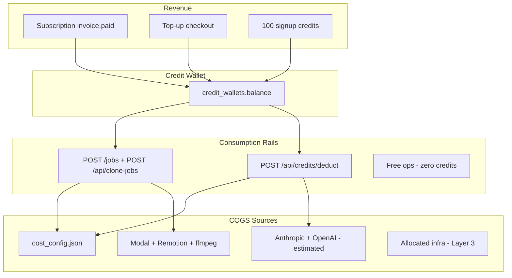

# Comprehensive UGC Platform Unit & Credits Economics Report

**Version:** June 2026 (authoritative full report)  
**Executive summary:** [`unit-economics-pricing-report.md`](unit-economics-pricing-report.md)  
**Task matrix (CSV):** [`unit-economics-task-matrix.csv`](unit-economics-task-matrix.csv)  
**Scope:** Report-only — billing gaps and stale UI are **documented**, not fixed.

---

## Table of Contents

1. [Platform Economics Architecture](#part-1--platform-economics-architecture)
2. [Complete Provider COGS Catalog](#part-2--complete-provider-cogs-catalog)
3. [Master Task Inventory (~60 rows)](#part-3--master-task-inventory)
4. [Workflow Deep-Dives](#part-4--workflow-deep-dives)
5. [Agent & LLM COGS Model](#part-5--agent--llm-cogs-model)
6. [Margin Verification Tables](#part-6--margin-verification-tables)
7. [Subscription & Top-Up Economics](#part-7--subscription--top-up-economics)
8. [Fully Loaded Unit Economics (Layer 3)](#part-8--fully-loaded-unit-economics-layer-3)
9. [Billing Enforcement Audit](#part-9--billing-enforcement-audit)
10. [Appendices](#part-10--appendices)

---

## Part 1 — Platform Economics Architecture

### 1.1 Credit flow (purchase → wallet → deduction → refund)



**Purchase paths**

| Path | Mechanism | Credits | $ in repo |
|------|-----------|---------|-----------|
| Welcome bonus | `credit_wallets` insert on first wallet | 100 | $0 |
| Top-up Small→XL | Stripe checkout → webhook | 300→6000 | $9→$139 in `manage/page.tsx` |
| Subscription | Stripe `invoice.paid` → monthly grant | 1k / 3.2k / 7k | **TBD** — Supabase `subscription_plans.price_monthly` |

**Deduction paths**

| Rail | Endpoint | Used by |
|------|----------|---------|
| Jobs rail | `POST /jobs` | Full UGC (15/30), clip jobs via Creative OS `create_job` |
| Clone rail | `POST /api/clone-jobs` | AI Clone talking-head |
| Deduct rail | `POST /api/credits/deduct` | Agent-gated ops in Creative OS (`core_api_client.deduct_credits`) |
| None | — | Discovery, scripts, captions, combine, legacy shots API |

**Refund paths**

| Trigger | Mechanism |
|---------|-----------|
| Job creation fails after deduct | `refund_credits` in `POST /jobs` |
| Onboarding first video | Charge via `/jobs`, then refund if ≤1 job in project (`generate_video.py`) |
| Failed job manual refund | `POST /jobs/{job_id}/refund` |

Credits **never expire**. Subscription monthly allotment **adds** to balance (does not reset).

### 1.2 Margin formula (Model A vs Model B)

**Target:** 70% gross margin on API COGS.

$$\text{Required Revenue} = \frac{\text{COGS}}{1 - 0.70} = \frac{\text{COGS}}{0.30}$$

$$\text{Credits (Model A)} = \left\lceil \frac{\text{COGS}}{0.30 \times 0.03} \right\rceil = \left\lceil \frac{\text{COGS}}{0.009} \right\rceil$$

$$\text{Gross margin %} = \frac{\text{credits} \times \text{RPC} - \text{COGS}}{\text{credits} \times \text{RPC}} \times 100$$

| Anchor | RPC | Divisor | Example: $0.30 Veo flat |
|--------|-----|---------|-------------------------|
| **Model A** | $0.03/credit | ÷ 0.009 | **34 credits** |
| **Model B** | $0.01/credit | ÷ 0.003 | **100 credits** (≈ Model A × 3.33) |

**Three COGS layers (used throughout this report)**

| Layer | Definition | Typical add-on |
|-------|------------|----------------|
| **L1 — API COGS** | Provider invoices from `cost_config.json` | — |
| **L2 — API + compute** | L1 + Modal ~$0.01/run + `processing` $0.01/video | +$0.01–0.02 per job |
| **L3 — Fully loaded** | L2 + allocated infra + Stripe fees | See Part 8 |

### 1.3 Production defaults vs brief assumptions

| Stated assumption | **Production path (code)** |
|-------------------|----------------------------|
| Digital 15s = Seedance | Default `model_api=veo-3.1-fast` (`config.py`, `core_engine.py`) |
| Physical = 2× Nano | `PHYSICAL_EXTEND_STRATEGY=parallel_i2v`: **1** Nano composite + **N** Veo i2v flats |
| ElevenLabs on all UGC | **Not** on Veo/Seedance (native audio); used for Clone + silent models |
| Claude 3.5 Sonnet | Runtime: **`claude-sonnet-4-6`** (`managed_agent_client.py`) |
| Cinematic animate COGS | Credits priced on **Fal Seedance Pro $0.30/s**; runtime uses **Kie Seedance @ $0.125/s** |

---

## Part 2 — Complete Provider COGS Catalog

Authoritative rates: [`ugc_backend/cost_config.json`](../ugc_backend/cost_config.json).  
Credit mapping: [`ugc_backend/credit_cost_service.py`](../ugc_backend/credit_cost_service.py).

### 2.1 WaveSpeed marketplace

| Provider | Service | Unit | Rate (USD) | Used by |
|----------|---------|------|------------|---------|
| WaveSpeed | Seedance 2 — 480p i2v | per second | $0.0575 | UGC Seedance (legacy paths) |
| WaveSpeed | Seedance 2 — 480p t2v | per second | $0.095 | Seedance t2v clips |
| WaveSpeed | Seedance 2 — 720p i2v | per second | $0.125 | **Production Seedance i2v**, Kie proxy |
| WaveSpeed | Seedance 2 — 720p t2v | per second | $0.205 | Digital hook scenes, t2v clips |
| WaveSpeed | Seedance 2 — 1080p i2v | per second | $0.31 | Optional quality |
| WaveSpeed | Seedance 2 — 1080p t2v | per second | $0.51 | Optional quality |
| WaveSpeed | Seedance 2 **Fast** 720p | per second | ~$0.18/s (480p note in Fal block) | Endpoints in code; **rates not split in JSON** |
| WaveSpeed | Veo 3.1 Lite 720p/1080p/4k | **flat per video** | $0.15 / $0.175 / $0.75 | Rare quality path |
| WaveSpeed | Veo 3.1 **Fast** 720p/1080p/4k | **flat per video** | $0.30 / $0.325 / $0.90 | **Default UGC clip** |
| WaveSpeed | Veo 3.1 Quality 720p/1080p/4k | flat per video | $1.25 / $1.275 / $1.85 | Premium |
| WaveSpeed | Veo 3.1 extend (fast/quality) | flat per extend | $0.30 / $1.25 | `extend_video` |
| WaveSpeed | Kling 3 standard + audio | per second | $0.10 | Cinematic clips, `animate_image` |
| WaveSpeed | Kling 3 pro + audio | per second | $0.135 | Pro cinematic |
| WaveSpeed | Kling 3 4K | per second | $0.335 | 4K path |
| WaveSpeed | Nano Banana Pro 1k/2k/4k | per image | $0.09 / $0.09 / $0.12 | Composites, stills, identity |
| WaveSpeed | InfiniTalk audio | per second | $0.022 | Clone lip-sync |

**Veo pricing note:** Veo is **flat per generated clip**, not per-second. `cost_service.estimate_total_cost()` uses Kie legacy **per-second proxies** ($0.04/s for fast) — flag drift vs WaveSpeed flats when auditing `total_cost` on job rows.

### 2.2 Fal AI (cinematic-ads skill)

| Provider | Service | Unit | Rate | Used by |
|----------|---------|------|------|---------|
| Fal | GPT Image 2 storyboard 2560×1792 | per image | $0.18 | `cinematic_storyboard` |
| Fal | Seedance 2 Pro 720p | per second | $0.30 | **Credit basis** for cinematic animate/broll/macro |

Runtime cinematic animation invokes **Kie Seedance** (`kie_seedance_client.py`) at **$0.125/s** — true runtime COGS is ~58% below Fal credit basis.

### 2.3 ElevenLabs

| Provider | Service | Unit | Rate | Used by |
|----------|---------|------|------|---------|
| ElevenLabs | TTS | per character | $0.00018 | Clone pipeline, silent-model voiceover |

Example: 130-char clone script → **$0.023**.

### 2.4 Kie.ai (legacy + runtime)

| Model key | Config rate | Note |
|-----------|-------------|------|
| seedance-2.0 | $0.125/s | Matches WaveSpeed 720p i2v |
| kling-2.6 | $0.10/s | Silent; needs ElevenLabs |
| veo-3.1-fast | $0.04/s proxy | Real: **$0.30 flat** |
| veo-3.1 quality | $0.16/s proxy | Real: **$1.275 flat** |
| nano_banana_pro | $0.09/image | |
| infinitalk-audio | $0.022/s | Clone |

### 2.5 Music & processing (in-repo)

| Key | Rate | Used by |
|-----|------|---------|
| `music.cost_per_video` | $0.05 | Suno via Kie when enabled |
| `processing.cost_per_video` | $0.01 | ffmpeg assembly, Modal worker overhead proxy |

### 2.6 LLM & vision (NOT in cost_config.json — gap table)

| Provider | Model | Rate (USD) | Source | Used by |
|----------|-------|------------|--------|---------|
| Anthropic | claude-sonnet-4-6 | $3 / $15 per 1M in/out + $0.08/session-hr | Anthropic pricing | Managed agent default |
| Anthropic | claude-haiku-4-5 | $1 / $5 per 1M | Anthropic pricing | Fallback / cheap turns |
| OpenAI | gpt-4o | ~$2.50 / $10 per 1M | OpenAI pricing | Scripts, campaign planner |
| OpenAI | whisper-1 | ~$0.006/min | OpenAI pricing | `caption_video` |
| Google | Gemini 2.5 Flash | variable | `GEMINI_API_KEY` | Analytics vision, optional |
| **Gemini Omni Video edit** | gemini-omni-video (Kie) | **$1.20 / $1.80** flat (720p / 4k) | `credit_cost_service` comments | `edit_video` |
| WaveSpeed | Kling element register | ~$0.01 | Code comment | `wavespeed_kling_element_register`: 2 cr |
| Modal | Serverless worker | ~$0.01/run (2 vCPU, 4GB) | Skills / migration doc | All dispatched jobs |
| Bright Data | Analytics scrape | out of scope | — | Appendix: analytics only |

---

## Part 3 — Master Task Inventory

Full spreadsheet: [`unit-economics-task-matrix.csv`](unit-economics-task-matrix.csv).

**Column legend**

| Column | Meaning |
|--------|---------|
| Task ID | Stable identifier |
| Credits (current) | `CREDIT_COSTS` / `_credits_for_op` |
| Credits (Model B) | ×3.33 rounded |
| API COGS | Layer 1 line-item sum |
| Compute COGS | Modal + processing |
| Revenue @ $0.03 | credits × 0.03 |
| Gross margin % | (rev − L1) / rev |
| Margin @ XL (2.3¢) | (credits × 0.023 − L1) / (credits × 0.023) |
| Deduction path | `/jobs`, `/deduct`, none |
| Enforcement | OK / GAP / FREE |
| Frontend display | Live / stale / missing |

### 3.1 Summary by category

| Category | Tasks | Enforcement OK | Known GAPs |
|----------|-------|----------------|------------|
| Full UGC 15/30 | 8 | 8/8 via `/jobs` | Stale CreateBar prices |
| Clip-level 5–10s | 12+ | **0** — `/jobs` length not in CREDIT_COSTS | **P0 revenue leak** |
| Images & identity | 8 | 6/8 | 4-view sheets underpriced; alt_versions no deduct |
| Animate / edit | 6 | 6/6 | — |
| Cinematic ads | 8 | 8/8 via `/deduct` | Stale cinematic page; runtime COGS << credits |
| Clone | 2 | 2/2 | — |
| Bulk | 2 | Clone OK | **bulk UGC no deduct** |
| Free ops | 10+ | FREE | COGS still incurred |

### 3.2 Critical gaps (explicit)

| Issue | Severity | Detail |
|-------|----------|--------|
| `POST /jobs/bulk` | **P0** | Creates N jobs; **no wallet deduction** (`main.py` ~2066–2341) |
| Clip lengths 5/8/10 via `/jobs` | **P0** | `get_video_credit_cost` only 15/30 → exception → **0 credits** |
| `generate_image_alt_versions` | **P1** | Quotes 20 cr; **no `_charge_for_op`** after confirm |
| Legacy `/api/products/.../shots` | **P1** | COGS tracked in worker; **0 credits** |
| 4-view identity/product at 10 cr | **P1** | ~4× Nano ≈ $0.36 COGS vs $0.30 revenue |
| Stale UI prices | **P2 UX** | CreateBar 156/245/12/35; cinematic 13/51; activity 39/77/100/199 |
| `GET /api/credits/costs` unused | **P2** | Frontend hardcodes estimates |

---

## Part 4 — Workflow Deep-Dives

Each table: **Step | Provider | API/model | Qty | Unit cost | Subtotal**.

Compute add-on: **+$0.01 Modal** + **+$0.01 processing** unless noted.

### 4.1 Full UGC pipelines

#### 4.1.1 Digital 15s — Veo production (default)

| Step | Provider | API/model | Qty | Unit | Subtotal |
|------|----------|-----------|-----|------|----------|
| Agent session | Anthropic | claude-sonnet-4-6 | ~4 turns | ~$0.025/turn | $0.10 |
| Script | OpenAI | gpt-4o | 1 call | ~$0.018 | $0.018 |
| Hook scene | WaveSpeed | Veo 3.1 Fast 720p | 1 clip | $0.30 flat | $0.30 |
| App demo | User clip | pre-recorded | 7s | $0 | $0 |
| Music (optional) | Kie/Suno | V4 | 0–1 | $0.05 | $0.00 default |
| Assembly | Modal/ffmpeg | processing | 1 | $0.01 | $0.01 |
| **L1 total** | | | | | **$0.57** (no music) |
| **L2 total** | | | | | **$0.59** |
| **Credits** | | | | | **67** → $2.01 @ 0.03 |
| **Margin L1** | | | | | **71.6%** |

#### 4.1.2 Digital 30s — Veo

| Step | Provider | API/model | Qty | Unit | Subtotal |
|------|----------|-----------|-----|------|----------|
| Agent + script | Anthropic + OpenAI | | | | $0.118 |
| Veo scenes | WaveSpeed | Veo 3.1 Fast | 3 clips | $0.30 | $0.90 |
| App demo clip | User | trim | 8–10s | $0 | $0 |
| Processing | | | 1 | $0.01 | $0.01 |
| **L1** | | | | | **$1.14** |
| **Credits** | | | | | **134** |

Scene plan from `config.SCENE_DURATIONS["30s"]`: hook 8s + app_demo 8s + reaction 8s + cta 8s (3 Veo gens + clip).

#### 4.1.3 Physical 15s — Veo `parallel_i2v`

| Step | Provider | API/model | Qty | Unit | Subtotal |
|------|----------|-----------|-----|------|----------|
| Agent + script | | | | | $0.115 |
| Composite still | WaveSpeed | Nano Banana Pro 2k | 1 | $0.09 | $0.09 |
| Scene animations | WaveSpeed | Veo 3.1 Fast i2v | 2 | $0.30 | $0.60 |
| Music/processing | | optional | | $0.06 | $0.06 |
| **L1** | | | | | **$0.87** |
| **Credits** | | | | | **101** |

#### 4.1.4 Physical 30s — Veo

| Step | Provider | Qty | Subtotal |
|------|----------|-----|----------|
| Agent + script | | | $0.118 |
| Nano composite | 1× | $0.09 |
| Veo i2v scenes | 4× | $1.20 |
| Overhead | | $0.06 |
| **L1** | | **$1.47–1.74** (bundle uses **$1.74** incl. agent) |
| **Credits** | | **202** |

#### 4.1.5 Digital 15s — Seedance (`model_api=seedance-2.0`)

From `SEEDANCE_SCENE_DURATIONS["15s_digital"]`:

| Step | Provider | API/model | Qty | Unit | Subtotal |
|------|----------|-----------|-----|------|----------|
| Agent + script | | | | | $0.115 |
| Hook t2v 720p | WaveSpeed | Seedance 2 | 8s | $0.205/s | $1.64 |
| App demo | User clip | | 7s | $0 | $0 |
| Processing | | | | $0.01 | $0.01 |
| **L1** | | | | | **$1.77** (config comment: $1.64 AI only) |
| **Credits** | | | | | **145** |
| **Margin @ 145 cr** | | | | | **~62%** (bundle priced on ~$1.29 stack in exec summary) |

#### 4.1.6 Physical 15s — Seedance chain

| Step | Provider | API/model | Qty | Unit | Subtotal |
|------|----------|-----------|-----|------|----------|
| Agent + script | | | | | $0.115 |
| Hook t2v | Seedance 720p t2v | 4s | $0.205/s | $0.82 |
| Main i2v | Seedance 720p i2v | 12s | $0.125/s | $1.50 |
| Processing | | | | $0.01 | $0.01 |
| **L1** | | | | | **$2.59** (incl. trim to 15s) |
| **Credits** | | | | | **288** |

#### 4.1.7 Bulk campaign (N videos)

| Item | Quoted | Actual deduction |
|------|--------|------------------|
| Agent `create_bulk_campaign` | N × bundle credits | **$0** — `/jobs/bulk` has no gate |
| COGS | N × per-video L1 | Still incurred |
| **Gap** | User confirms N×67 etc. | **P0 leak** |

---

### 4.2 Clip-level generation

#### 4.2.1 Veo 5/8/10s flat (ugc mode)

| Step | Provider | Qty | Subtotal |
|------|----------|-----|----------|
| Veo 3.1 Fast | 1 clip | $0.30 |
| Modal worker | 1 run | $0.01 |
| **L1** | | **$0.30** |
| **Credits (quoted)** | | **34** |
| **Credits (charged)** | | **0** — `length` ∉ {15,30} |

#### 4.2.2 Kling cinematic N sec (with audio)

| Step | Provider | Qty | Subtotal |
|------|----------|-----|----------|
| Optional Nano composite | Nano | 0–1 | $0–0.09 |
| Kling 3 + audio | $0.10/s | N s | $0.10×N |
| **5s example L1** | | **$0.50** |
| **Credits quoted** | 12/s × N | **60 @ 5s** |
| **Charged** | | **0** via `/jobs` gap |

#### 4.2.3 Seedance clip (i2v vs t2v)

| Mode | 5s COGS | Credits quoted |
|------|---------|----------------|
| With reference (i2v) | 5 × $0.125 = $0.625 | 14/s → **70** |
| Text-only (t2v) | 5 × $0.205 = $1.025 | 23/s → **115** |

#### 4.2.4 Dynamic speaking 15s/30s

Seedance chain inside `generate_video` with `dynamic_speaking=true`. Billed as full UGC bundle when 30s parallel legs; 15s uses clip pricing — **same `/jobs` gap** for sub-15 clip rows.

#### 4.2.5 Veo extend

| Step | Provider | Subtotal |
|------|----------|----------|
| Veo extend fast | $0.30 flat |
| **Credits** | **34** via `extend_video` → `/deduct` **OK** |

---

### 4.3 Image & identity

| Task | API steps | L1 COGS | Credits | Enforcement |
|------|-----------|---------|---------|-------------|
| Single still (`generate_image`) | 1× Nano 2k | $0.09 | 10 | OK `/deduct` |
| `generate_influencer` | Nano + LLM name | ~$0.11 | 10 | OK |
| `generate_identity` 4-view | 4× Nano or 1 multi | ~$0.36 | 10 | **Underpriced** |
| `generate_product_shots` 4-view | 4× Nano | ~$0.36 | 10 | **Underpriced** |
| `generate_image_alt_versions` | 2× edit-multi | ~$0.18 | 20 quoted | **No deduct** |
| Text-to-image | 1× Nano | $0.09 | 10 | OK |

---

### 4.4 Animation & edit

| Task | Stack | L1 | Credits | Path |
|------|-------|-----|---------|------|
| `animate_image` 5s | Kling 3 + audio 5s | $0.50 | 56 | `/deduct` |
| `animate_image` 10s | 10s | $1.00 | 112 | `/deduct` |
| `edit_video` 720p | Gemini Omni ×1 | $1.20 | 134 | `/deduct` |
| `edit_video` 4k | Gemini Omni ×1 | $1.80 | 200 | `/deduct` |
| `edit_video` >10s | Multi-pass 720p | ~$2.40 | 268 (2×) | `/deduct` |
| `render_edited_video` | Remotion on Modal | ~$0.02 | 2 | `/deduct` |

---

### 4.5 Cinematic ads (full funnel)

#### Stage COGS — dual view (credits vs runtime)

| Stage | Credits | Revenue @0.03 | Fal credit COGS | Kie runtime COGS |
|-------|---------|---------------|-----------------|------------------|
| `propose` | 0 | $0 | ~$0.15 LLM | ~$0.15 |
| `storyboard` | 20 | $0.60 | $0.18 | $0.18 |
| `animate` 5s | 170 | $5.10 | $1.50 | **$0.625** |
| `animate` 10s | 340 | $10.20 | $3.00 | **$1.25** |
| `animate` 15s | 510 | $15.30 | $4.50 | **$1.875** |
| `broll` 5s | 170 | $5.10 | $1.50 | **$0.625** |
| `product_macro` 5s | 170 | $5.10 | $1.50 | **$0.625** |

**Full ad example (storyboard + 15s hero + broll + macro):**

| Line | Subtotal |
|------|----------|
| Agent ~5 turns | $0.20 |
| Storyboard | $0.18 |
| Animate 15s (runtime) | $1.875 |
| Broll 5s | $0.625 |
| Macro 5s | $0.625 |
| **L1 runtime** | **~$3.51** |
| **Credits sum** | 20+510+170+170 = **870** → $26.10 |
| **Quoted bundle (agent)** | Often **890** with overhead |

**Answer:** 15s cinematic ad with broll ≈ **$3.5–4.9 L1 COGS** vs **$26.1 revenue** → high margin at runtime; still >70% even on Fal-priced COGS ($4.88 minimal hero+story).

---

### 4.6 AI Clone

| Step | Provider | 15s | 30s |
|------|----------|-----|-----|
| ElevenLabs TTS | ~130 / ~260 chars | $0.023 | $0.047 |
| InfiniTalk lip-sync | $0.022/s | $0.33 | $0.66 |
| Optional Nano composite | | $0.09 | $0.09 |
| Processing | | $0.01 | $0.01 |
| **L1** | | **~$0.47** | **~$0.94** |
| **Credits** | | **53** | **106** |
| **Path** | | `POST /api/clone-jobs` | OK |

---

### 4.7 Free-but-costly operations

| Operation | COGS estimate | Credits | Notes |
|-----------|---------------|---------|-------|
| `caption_video` | Whisper ~$0.01 + Remotion ~$0.05 | 0 | Free in agent |
| `generate_scripts` | gpt-4o ~$0.015 | 0 | |
| `generate_ai_script` | gpt-4o ~$0.015 | 0 | |
| `plan_campaign` | gpt-4o ~$0.05 | 0 | |
| `combine_videos` | ffmpeg; Suno $0.05 if music | 0 | Comment claims upstream deduct — **false** |
| `apply_editor_ops` | DB only | 0 | |
| Agent discovery turns | ~$0.01–0.03/turn | 0 | Cached input cheaper |
| Onboarding 5s Seedance | ~$0.635 | 0 after refund | Charge then refund |

---

## Part 5 — Agent & LLM COGS Model

**Runtime model:** `claude-sonnet-4-6` (Managed Agents beta).  
**Rates (June 2026):** Input $3/M, Output $15/M, session overhead ~$0.08/hr.

### 5.1 Token budgets per workflow

| Workflow | Turns | Input (fresh) | Input (cached) | Output | Est. $ |
|----------|-------|---------------|----------------|--------|--------|
| Typical `create_ugc_video` session | 4 | ~8k | ~4k | ~2k | **$0.10–0.13** |
| Typical `create_cinematic_ad` | 5–6 | ~12k | ~6k | ~3k | **$0.18–0.25** |
| Clip `generate_video` only | 2 | ~4k | ~2k | ~800 | **$0.04–0.06** |
| `create_bulk_campaign` N=5 | 3 + confirm | ~10k | ~5k | ~2k | **$0.12** (+ N×video) |
| Discovery-heavy first turn | 1 | ~15k tools | — | ~1k | **$0.06** |
| Script generation (free) | 1 | ~2k | — | ~500 | **$0.015** |
| Caption + hashtags | 1 | ~3k | — | ~400 | **$0.012** |

**Bundled overhead keys in CREDIT_COSTS:** `agent_session_ugc` = 13 credits ($0.39 revenue vs ~$0.10 COGS — intentionally conservative).

### 5.2 Monthly subscriber LLM reconciliation

CTO migration doc cites **€0.96–€8.67/sub/mo** LLM at scale. Reconciliation:

| Persona | Assumed agent jobs/mo | LLM/mo |
|---------|----------------------|--------|
| Light Starter | 3 UGC + 2 clips | ~€0.50 |
| Active Creator | 20 UGC + 5 clips + 2 cinematic | ~€3.5 |
| Power Business | 40 UGC + 10 clips + 5 cinematic | ~€8–9 |

At 7k subscribers Y1 base (~700 DAU), **~250k credit-ops/day** per migration doc → LLM is **&lt;5% of COGS** vs video APIs.

---

## Part 6 — Margin Verification Tables

### 6.1 Post-repricing proof — every `CREDIT_COSTS` key (Model A)

Formula: margin = (credits × 0.03 − COGS) / (credits × 0.03).

| Key | Cr | COGS L1 | Rev | Margin L1 | ≥70%? |
|-----|-----|---------|-----|-----------|-------|
| `("digital", 15)` | 67 | 0.57 | 2.01 | 71.6% | ✓ |
| `("digital", 30)` | 134 | 1.14 | 4.02 | 71.6% | ✓ |
| `("physical", 15)` | 101 | 0.87 | 3.03 | 71.3% | ✓ |
| `("physical", 30)` | 202 | 1.74 | 6.06 | 71.3% | ✓ |
| `("digital_seedance", 15)` | 145 | 1.64 | 4.35 | 62.3% | ✗ (optimistic bundle) |
| `("digital_seedance", 30)` | 290 | 3.32 | 8.70 | 61.8% | ✗ |
| `("physical_seedance", 15)` | 288 | 2.59 | 8.64 | 70.0% | ~✓ |
| `("physical_seedance", 30)` | 576 | 4.83 | 17.28 | 72.0% | ✓ |
| `cinematic_image_*` | 10–14 | 0.09–0.12 | 0.30–0.42 | 67–71% | ~✓ |
| `cinematic_video_8s` | 44 | 0.30 | 1.32 | 77.3% | ✓ |
| `creative_os_image` | 10 | 0.09 | 0.30 | 70.0% | ✓ |
| `animate_image_5s` | 56 | 0.50 | 1.68 | 70.2% | ✓ |
| `video_clip_veo_fast_720p` | 34 | 0.30 | 1.02 | 70.6% | ✓ (if charged) |
| `video_clip_cinematic_per_s` | 12/s | 0.10/s | 0.36/s | 72.2% | ✓ |
| `video_clip_clone_per_s` | 3/s | 0.022/s | 0.09/s | 75.6% | ✓ |
| `video_clip_seedance_with_ref_per_s` | 14/s | 0.125/s | 0.42/s | 70.2% | ✓ |
| `video_clip_seedance_no_ref_per_s` | 23/s | 0.205/s | 0.69/s | 70.3% | ✓ |
| `("clone", 15)` | 53 | 0.47 | 1.59 | 70.4% | ✓ |
| `("clone", 30)` | 106 | 0.94 | 3.18 | 70.4% | ✓ |
| `editor_render` | 2 | 0.01 | 0.06 | 83.3% | ✓ |
| `cinematic_storyboard` | 20 | 0.18 | 0.60 | 70.0% | ✓ |
| `cinematic_animate_720p_5s` | 170 | 0.625* | 5.10 | 87.7% | ✓ (*runtime) |
| `cinematic_animate_720p_15s` | 510 | 1.875* | 15.30 | 87.7% | ✓ |
| `cinematic_broll_720p_5s` | 170 | 0.625 | 5.10 | 87.7% | ✓ |
| `gemini_omni_edit_720p` | 134 | 1.20 | 4.02 | 70.1% | ✓ |
| `gemini_omni_edit_4k` | 200 | 1.80 | 6.00 | 70.0% | ✓ |
| `agent_session_ugc` | 13 | 0.10 | 0.39 | 74.4% | ✓ |
| `script_generation` | 2 | 0.015 | 0.06 | 75.0% | ✓ |
| `music_per_video` | 6 | 0.05 | 0.18 | 72.2% | ✓ |
| `processing_per_video` | 2 | 0.01 | 0.06 | 83.3% | ✓ |
| `elevenlabs_per_1k_chars` | 20 | 0.18 | 0.60 | 70.0% | ✓ |

**Layer 2 erosion example (digital 15s Veo):** L2 COGS $0.59 → margin **70.6%** (still passes).

**Underpriced / not charged:** 4-view sheets (10 cr vs $0.36 COGS); clip jobs when `/jobs` gap applies (**margin −∞**).

### 6.2 Purchase-price sensitivity (effective ¢/credit)

| Task | Cr | COGS | @3.0¢ | @2.7¢ | @2.5¢ | @2.3¢ (XL) |
|------|-----|------|-------|-------|-------|------------|
| Digital 15s Veo | 67 | 0.57 | 71.6% | 68.5% | 65.7% | 63.0% |
| Cinematic 15s hero | 510 | 1.875 | 87.7% | 86.4% | 85.0% | 84.0% |
| Gemini 720p edit | 134 | 1.20 | 70.1% | 66.9% | 64.2% | 61.1% |
| Seedance phys 15s | 288 | 2.59 | 70.0% | 66.7% | 64.1% | 60.9% |

**Tasks that lose money at XL top-up (2.3¢/cr):**

| Task | COGS | XL revenue | Result |
|------|------|------------|--------|
| `generate_identity` / `product_shots` | ~$0.37 | $0.23 | **−37%** |
| Any **uncharged** clip (quoted 34+) | ≥$0.30 | $0 | **−100%** |
| Bulk UGC N× | N×0.59 | $0 | **−100%** |

### 6.3 Blended scenarios

**Assumptions:** RPC = $0.03; COGS from L1.

| Scenario | Mix | Blended COGS/job | Blended cr | Blended margin |
|----------|-----|------------------|------------|----------------|
| **A — Typical platform** | 80% Veo UGC ($0.59), 15% clips+images ($0.35 avg), 5% cinematic ($3.5) | ~$0.75 | ~72 | **~65%** |
| **B — 100% cinematic user** | 100% animate 15s runtime | $1.875 | 510 | **87.7%** |
| **C — Seedance toggle user** | 100% physical Seedance 15s | $2.59 | 288 | **70.0%** |
| **D — Creator subscriber** | 20× digital 15 Veo + 2× cinematic full | — | 20×67+2×870 = 3080 cr | Rev $92.4; COGS ~$18.8 → **79.6%** |

**Creator monthly worksheet (from plan):**

- Subscription: **3,200 credits/mo** (migration 061)
- If Starter = **$X/mo** → effective ¢/credit = **X / 1000** (fill from Supabase)
- SQL: `SELECT name, price_monthly, credits_monthly FROM subscription_plans;`

---

## Part 7 — Subscription & Top-Up Economics

### 7.1 Top-up packages (in-repo)

Source: [`frontend/src/app/manage/page.tsx`](../frontend/src/app/manage/page.tsx), [`TOPUP_PACKAGES`](../ugc_backend/main.py).

| Package | Credits | Price | ¢/credit |
|---------|---------|-------|----------|
| Small | 300 | $9 | 3.0¢ |
| Medium | 900 | $24 | 2.7¢ |
| Large | 2400 | $59 | 2.5¢ |
| XL | 6000 | $139 | **2.3¢** |

Stripe flow: checkout session → webhook `checkout.session.completed` → `add_credits` with idempotency on session id.

### 7.2 Subscription plans (migration 061 — DB not in repo)

| Plan | credits_monthly | price_monthly |
|------|-----------------|---------------|
| Starter | 1,000 | **TBD** (Supabase) |
| Creator | 3,200 | **TBD** |
| Business | 7,000 | **TBD** |

Migration file: [`ugc_db/migrations/061_update_pricing_credits.sql`](../ugc_db/migrations/061_update_pricing_credits.sql) — **not confirmed applied**.

### 7.3 Welcome bonus & onboarding

| Event | Credits | $ |
|-------|---------|---|
| Signup wallet | +100 | $0 |
| Onboarding 5s Seedance clip | Charge 34 then **refund** if first project job | Net 0 |

Onboarding instructions: [`services/creative-os/routers/agent.py`](../services/creative-os/routers/agent.py) (`ONBOARDING_FIRST_VIDEO`).

### 7.4 Credit accounting rules

- Credits **accumulate** across months (no reset).
- Failed jobs: manual `POST /jobs/{id}/refund` or automatic on creation failure.
- Spend rollup: [`GET /stats/costs`](../ugc_backend/main.py) uses `metadata.credits_deducted` or recomputes from current `CREDIT_COSTS`.

---

## Part 8 — Fully Loaded Unit Economics (Layer 3)

Sources: [`Aitoma_Studio_AWS_Migration_Architecture.md`](../Aitoma_Studio_AWS_Migration_Architecture.md).

### 8.1 Infra assumptions

| Stage | Monthly infra | Jobs/mo (example) | Allocated $/job |
|-------|---------------|-------------------|-----------------|
| Pre-launch | ~€200 (Railway+Modal+Supabase+Vercel) | ~3,000 | **~$0.07** |
| Y1 base (7k subs) | $3k–5k AWS equivalent | ~300k ops | **~$0.01–0.02** |
| 10k video jobs/day | ~$1,000 Batch compute | 300k | **~$0.003** video |

Add **Stripe**: 2.9% + $0.30 per top-up/subscription transaction.

### 8.2 Layer comparison — typical Creator job (digital 15s Veo)

| Layer | COGS | Margin @ 67 cr / $0.03 |
|-------|------|------------------------|
| L1 API | $0.57 | 71.6% |
| L2 + compute | $0.59 | 70.6% |
| L3 + $0.02 infra + 3% Stripe on $2.01 | ~$0.65 | **67.7%** |

At **XL top-up** (2.3¢): L3 margin on same job ≈ **59%**.

### 8.3 Fully loaded cinematic 15s (runtime COGS)

| Layer | $ | Margin @ 510 cr |
|-------|---|-----------------|
| L1 | $1.875 | 87.7% |
| L3 (+$0.02 infra) | $1.895 | **87.6%** |

Cinematic remains high-margin even fully loaded because **credit prices use Fal $0.30/s** while runtime pays Kie $0.125/s.

---

## Part 9 — Billing Enforcement Audit

### 9.1 Matrix (task × quoted × deducted × refund)

| Task | Quoted cr | Deducted? | Refund on fail? | Severity |
|------|-----------|-----------|-----------------|----------|
| UGC 15/30 `/jobs` | 67–576 | ✓ | ✓ create fail | OK |
| Clip 5–10 `/jobs` | 34–120 | **✗ 0** | N/A | **P0** |
| `/jobs/bulk` | N× bundle | **✗** | N/A | **P0** |
| `/api/credits/deduct` ops | per table | ✓ | partial | OK |
| Clone `/api/clone-jobs` | 53–106 | ✓ | manual | OK |
| `alt_versions` | 20 | **✗** | N/A | **P1** |
| Legacy shots API | — | **✗** | N/A | **P1** |
| Onboarding clip | 0 (UX) | 34→refund | ✓ | OK |
| Free scripts/captions | 0 | ✗ | N/A | By design |

### 9.2 Frontend stale price inventory

| Location | Shows | Should be (Model A) |
|----------|-------|---------------------|
| `CreateBar.tsx` | 156 / 245 / 12 / 35 | 67–576 / 10 / 34–120 |
| `cinematic/page.tsx` | 13×N images, 51 video | 10 / 44–510 |
| `activity/page.tsx` | 39/77/100/199 | Use `GET /api/credits/costs` or job metadata |
| `en.json` imageModal | 12 credits | 10 |
| `GenerateShotModal.tsx` | 13 / 51 | 10 / 44 |

### 9.3 Severity-ranked remediation backlog

| ID | Issue | Severity | Status |
|----|-------|----------|--------|
| R1 | Deduct N× credits on `/jobs/bulk` | P0 | **Fixed** — upfront deduct + partial refund |
| R2 | Clip lengths 5–10 via `/jobs` | P0 | **Fixed** — `resolve_job_credit_cost()` |
| R3 | Wire `alt_versions` + legacy shots | P1 | **Fixed** |
| R4 | Reprice 4-view sheets to 40 cr | P1 | **Fixed** |
| R5 | Frontend consume `/api/credits/costs` | P2 | **Fixed** — `credit-costs.ts` |
| R6 | Apply migration 062 + Stripe prices | P2 | **Pending ops** — SQL in repo |

---

## Part 10 — Appendices

### Appendix A — `CREDIT_COSTS` snapshot (Model A)

```python
CREDIT_COSTS = {
    ("digital", 15): 67,
    ("digital", 30): 134,
    ("physical", 15): 101,
    ("physical", 30): 202,
    ("digital_seedance", 15): 145,
    ("digital_seedance", 30): 290,
    ("physical_seedance", 15): 288,
    ("physical_seedance", 30): 576,
    "cinematic_image_1k": 10,
    "cinematic_image_2k": 10,
    "cinematic_image_4k": 14,
    "cinematic_video_8s": 44,
    "creative_os_image": 10,
    "animate_image_5s": 56,
    "video_clip_ugc_per_s": 34,
    "video_clip_veo_fast_720p": 34,
    "video_clip_veo_fast_1080p": 37,
    "video_clip_cinematic_per_s": 12,
    "video_clip_clone_per_s": 3,
    "video_clip_seedance_with_ref_per_s": 14,
    "video_clip_seedance_no_ref_per_s": 23,
    ("clone", 15): 53,
    ("clone", 30): 106,
    "editor_render": 2,
    "cinematic_storyboard": 20,
    "cinematic_animate_720p_5s": 170,
    "cinematic_animate_720p_10s": 340,
    "cinematic_animate_720p_15s": 510,
    "cinematic_broll_720p_5s": 170,
    "cinematic_product_macro_720p_5s": 170,
    "gemini_omni_edit_720p": 134,
    "gemini_omni_edit_4k": 200,
    "agent_session_ugc": 13,
    "script_generation": 2,
    "music_per_video": 6,
    "processing_per_video": 2,
    "elevenlabs_per_1k_chars": 20,
}
```

### Appendix B — Model B credit table (×3.33)

Multiply every Model A value by **3.33** (or use divisor 0.003). Examples: digital 15s → **223**; cinematic animate 15s → **1698**; veo clip → **113**.

### Appendix C — `cost_config.json` annotated

See Part 2. Key drift: Kie `veo-3.1-fast` proxy **$0.04/s** vs WaveSpeed flat **$0.30/video**.

### Appendix D — Frontend stale prices

See §9.2. Canonical API: `GET /api/credits/costs` → `export_credit_cost_table()`.

### Appendix E — Brief stack vs production

| Workflow | Brief (Seedance+EL) | Production (Veo) |
|----------|---------------------|------------------|
| Digital 15s | ~$1.29 | **~$0.57** |
| Physical 15s | ~$1.00 (2 Nano) | **~$0.87** (1 Nano + 2 Veo) |
| Cinematic 15s minimal | ~$4.88 (Fal) | Runtime **~$3.5** (Kie) |

### Appendix F — Glossary

| Term | Meaning |
|------|---------|
| **RPC** | Revenue per credit ($0.03 Model A) |
| **COGS** | Provider + compute cost excl. infra |
| **Bundle pricing** | Full UGC job single credit quote |
| **Atomic pricing** | Per-second or per-stage keys |
| **Flat Veo** | One API call = one $0.30 (720p fast) regardless of 5–8s |
| **parallel_i2v** | One Nano composite + parallel Veo scene gens |

---

## Quick-reference answers (success criteria)

| Question | Answer (this report) |
|----------|----------------------|
| COGS + margin for 15s cinematic ad **with broll**? | ~$3.5 L1 runtime; credits 20+510+170 = 700 (+ macro +170 optional); margin **~87%** @ 0.03 |
| Tasks losing money at **XL 2.3¢**? | 4-view sheets; **any uncharged clip/bulk** |
| Claude cost UGC vs cinematic? | ~**$0.10** vs ~**$0.20** per session (Part 5) |
| Ops showing price but charging **$0**? | Clips via `/jobs`, bulk, alt_versions, legacy shots |
| Blended margin Creator 20 Veo + 2 cinematic? | **~79.6%** L1 (Scenario D, §6.3) |

---

*End of report. For executive summary and implementation status, see [`unit-economics-pricing-report.md`](unit-economics-pricing-report.md).*
